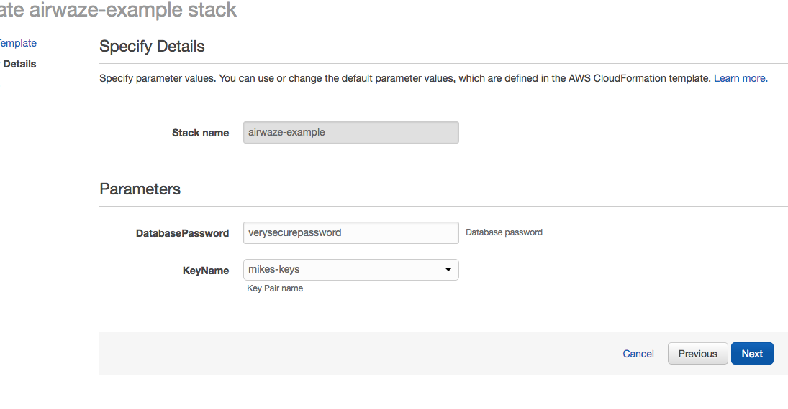

The ability to scale horizontally is very important in building Cloud Native applications.  In this studio, you will be extending your [Airwaze App](https://gitlab.com/LaunchCodeTraining/airwaze-studio) to scale horizontally as traffic on the server increases.

## Setup

FIRST, change your project to run on port 80.  Add this line to your `applications.properties` file:
```
server.port=80
```

<aside class="aside-note">
  Note!  You will be working in the "Northern Virginia region.
</aside>

We will be using the AWS CLI tool for some parts of the studio.  The AWS CLI tool allows you to create and change infrastructure on the cloud via the command line.  

To install the AWS CLI tool run the following commands:
```
$ brew install awscli
$ echo 'complete -C aws_completer aws' >> ~/.bashrc
$ aws --version
```

Next configure the AWS CLI tool with your credentials.  These credentials can be found in IAM > Users > You. Click "Create Access Key".


<aside class="aside-note">
  It is very important that you keep the `AWS Secret Access Key` private.  Access to that key allows anyone to programmatically spin up infrastructure on the AWS account. 
</aside>

Next configure your the AWS CLI tool.  Use the "Default region name" or `us-east-1`:
```
$ aws configure
AWS Access Key ID [None]: AK-------------------
AWS Secret Access Key [None]: r4------------------
Default region name [None]: us-east-1
Default output format [None]: 
```

You should now be able to run commands against AWS.  For example, you should now be able to list all of the buckets in S3:
```
$ aws s3 ls
```

Take a look around by looking at the help pages for a couple of commands:
```
$ aws help
$ aws s3 help
$ aws s3 sync help
```  

The `aws help` command is a quick alternative to looking up information about the tool on line.

### Configure your VPC

You are going to use Amazon CloudFormation to spin up your VPC.  CloudFormation can create infrastructure on AWS based on a JSON template.  CloudFormation allows you to create consistent, reproducible AWS environments.

You'll be using a CloudFormation template that adds 1 database, 4 subnets, 3 security groups, and 1 database.  AWS CloudFormation will pull the template from S3.  Feel free to take a look at the template by downloading it with the `aws-cli` tool:
```
aws s3 sync s3://launchcode-gisdevops-cloudformation 
```

To run CloudFormation, navigate to the CloudFormation page via the search bar.  Click "Create Stack".



Now we tell CloudFormation what JSON template to use when building the infrastructure.  We're going to give it the URL of the JSON template that we looked at with the `aws s3 sync ...` command.

* Choose "Specify an Amazon S3 template URL" and paste in https://s3.amazonaws.com/launchcode-gisdevops-cloudformation/airwaze_cloudformation.json. 
* Click "Next" when you are done. 


Next we need to give your stack a name and pass along a few parameters to customize the VPC.

* Fill in Stack Name with "airwaze-{your name}".
* Fill in DatabasePassword with "verysecurepassword".
* Fill in KeyName with with the name of your access key.  Since you are in a new Region, you will need to create a new KeyPair.  Follow the [instructions from the AWS Studio](https://education.launchcode.org/gis-devops/studios/AWS/#setting-up-a-keypair)


* Click Next on the "Options Screen"
* Click Create on the "Review Screen"

It will take CloudFormations about 15 minutes to spin up your VPC.  The "Events" tab will give you continuous updates on the progress of the job.

### Configure Buckets

Since you will be scaling machines horizontally, you won't be able to `scp` a jar to each machine.  Instead, the machines will reach out and grab a copy of the jar when they spin up.  The servers will download a copy of the application from S3.

First create a new bucket in S3.  Remember **EVERY** bucket in S3 in the whole wide world has to be unique.  Use the pattern below to get a unique name.

```
$ aws s3 mb s3://launchcode-gisdevops-c1-yourname/
```

Run `aws s3 ls` to make sure that the bucket was created properly.

Go ahead and build a new executable jar file using the Gradle `bootRepackage` command.  When it is finished building rename the file to `app.jar` and upload the jar to S3 using the following command:

```
$ aws s3 cp build/libs/app.jar s3://launchcode-gisdevops-c1-yourname/ 
$ aws s3 ls s3://launchcode-gisdevops-c1-yourname/ # check to make sure it uploaded
```

When we run our initialization script later, the script will pull down the `app.jar` file with this command:
```
$ aws s3 sync s3://launchcode-gisdevops-c1-yourname/ /opt/airwaze
```

You should also check out S3 in the console:
https://s3.console.aws.amazon.com/s3/home?region=us-east-1


### Configure the database

You'll also need to do some initial database setup.

Create an instance in the `SubnetWebAppPublic` subnet.  Once it is up, SSH into the server and run the following commands:

```
$ sudo apt-get update
$ sudo apt-get install postgresql
$ psql -h airwaze-example.cew68jaqkoek.us-east-1.rds.amazonaws.com -p 5432 -U masterUser airwaze
CREATE USER airwaze_user WITH PASSWORD 'verysecurepassword';
CREATE EXTENSION postgis;
CREATE EXTENSION postgis_topology;
CREATE EXTENSION fuzzystrmatch;
CREATE EXTENSION postgis_tiger_geocoder;
CREATE TABLE airport
(
id serial primary key,
airport_id integer,
airport_lat_long geometry,
altitude integer,
city character varying(255),
country character varying(255),
faa_code character varying(255),
icao character varying(255),
name character varying(255),
time_zone character varying(255)
);
CREATE TABLE route
(
id serial primary key,
airline character varying(255),
airline_id integer,
dst character varying(255),
dst_id integer,
route_geom geometry,
src character varying(255),
src_id integer
);
ALTER TABLE airport OWNER to airwaze_user;
ALTER TABLE route OWNER to airwaze_user;
```

Also, send up the `routes.csv` file and the `Airports.csv` file and get those in the database. 
```
$ scp -i ~/.ssh/mikes-keys.pem routes.csv  ubuntu@35.170.78.180:/home/ubuntu
$ scp -i ~/.ssh/mikes-keys.pem Airports.csv  ubuntu@35.170.78.180:/home/ubuntu
$ psql -h airwaze-example.cew68jaqkoek.us-east-1.rds.amazonaws.com -d airwaze -U airwaze_user -c "\copy route(src, src_id, dst, dst_id, airline, route_geom) from STDIN DELIMITER ',' CSV HEADER" < /home/ubuntu/routes.csv
$ psql -h airwaze-example.cew68jaqkoek.us-east-1.rds.amazonaws.com -d airwaze -U airwaze_user -c "\copy airport(airport_id, name, city, country, faa_code, icao, altitude, time_zone, airport_lat_long) from STDIN DELIMITER ',' CSV HEADER" < /home/ubuntu/Airports.csv
```

## Create the Launch Configuration

You now have all of the pieces set up to begin Auto Scaling EC2 machines.

Navigate to [AutoScaling Page](https://console.aws.amazon.com/ec2/autoscaling/home) on the sidebar of EC2.  Click "Create Auto Scaling Group".

 

A LaunchConfiguration is essentially creating a template for all of the EC2 instances that will be spun up automatically via Auto Scale.

* You are going to create a new Launch Configuration.


The Launch Configuration is going to be very similar to setting up a normal EC2 instance.  

* Choose the Ubuntu distribution on the AMI screen.


* Choose the micro instance.


There are several important configurations that have to be made on the "Configure Details" screen.

The moist important is the User data.  The "User data" is the script that runs as the server starts up.  This script creates the proper directories, configures systemd, and launches the app. Additionally, the app pulls down a copy of the jar file from S3. 

There are two pieces of data to change in the "User data" script: 

1) Set `APP_DB_HOST` to the endpoint of your RDS database. 

2) Change the `aws s3 c s3://launchcode-gisdevops-c1-yourbucket/app.jar /opt/airwaze/app.jar` command to point to the bucket that you created earlier in the studio.

* Paste your updated script in the "User data" field.

* Set "IAM role" to "EC2_to_S3_readonly". When the machine is spinning up, the startup script will need to reach out to S3.  The "IAM role" gives the startup script the proper credentials to be authenticated to access S3.

* Set the name of the configuration to `airwaze-{your name}-config`.

* Change the "IP Address Type" to be `Assign a public IP address to every instance`.


* Click "Next: Configure Security Group"

* On the Security Group screen, choose the `WebAppSecurityGroup` from your VPC.  The key is that you want to have ports 22 and 80 open on the machines that you are running.

* Click "Review"

* Click "Create Launch configuration"

```
#!/bin/bash
# Install Java
apt-get update -y && apt-get install -y openjdk-8-jdk awscli

# Create airwaze user
useradd -M airwaze
mkdir /opt/airwaze
mkdir /etc/opt/airwaze
aws s3 cp s3://launchcode-gisdevops-c1-traineemike/app.jar /opt/airwaze/app.jar 
chown -R airwaze:airwaze /opt/airwaze /etc/opt/airwaze
chmod 777 /opt/airwaze

# Write Airwaze config file
cat << EOF > /etc/opt/airwaze/airwaze.config
APP_DB_HOST=airwaze-example.cew68jaqkoek.us-east-1.rds.amazonaws.com
APP_DB_PORT=5432
APP_DB_NAME=airwaze
APP_DB_USER=airwaze_user
APP_DB_PASS=verysecurepassword
EOF

# Write systemd unit file
cat << EOF > /etc/systemd/system/airwaze.service
[Unit]
Description=Airwaze Studio
After=syslog.target

[Service]
User=airwaze
EnvironmentFile=/etc/opt/airwaze/airwaze.config
ExecStart=/usr/bin/java -jar /opt/airwaze/app.jar SuccessExitStatus=143
Restart=always

[Install]
WantedBy=multi-user.target
EOF

systemctl enable airwaze.service
```


## Create the Auto Scale Group

The Auto Scale Group is the piece of configuration responsible for how and when new machines are spun up (and spun down).

The first step is configuring where the machines will be spun up.

* For "Group name", provide a name similiar to `airwaze-{your name}` (replace {your name} of course...)

* For "Network", choose your VPC.

* For "Subnet", choose the `SubnetWebAppPublic`.

* Click "Next: Configure Scaling Policy"


The next screen configures how an app scales up.

* Select `Use scaling policies to adjust the capacity of this group`.

* Mark that the app can scale up to 5 machines.

* Change the name to `Scale Fast!`.

* Set the "Target value" to 5.  "Target value" is the percentage of CPU that triggers another machine to be provisioned.

* Set the "Instances need" to 40 seconds.  Since Spring Boot packages the web server in the jar, your application doesn't need as much spin up time as other machines.

* Click "Next: Configure Notifications"


* Click "Next: Configure Tags"

* Click "Review"

* Click "Create Auto Scaling Group"

This will create you Auto Scaling Group.  At first, the summary page will say 0 instances; it typically takes a couple of minutes to initialize.


The "Instances" tab will show you how many machines you currently have running in your Auto Scaling Group.


Next you need to hook a load balancer up to your Auto Scaling Group.  We'll need to configure the Target Groups of the Elastic Load Balancer.

* Navigate to the [Target Groups Page](https://console.aws.amazon.com/ec2/v2/home?&region=us-east-1#TargetGroups:sort=targetGroupName) and select the Target Group in your VPC.

* Click "Edit"


* Select `WebAppTargets` from the "Target Groups" drop down.


## Placing Load on your App

Next, you want to test that your autoscaling is working properly.  

You are going to be using a Node library called [loadtest](https://www.npmjs.com/package/loadtest).  
[loadtest](https://www.npmjs.com/package/loadtest) measures the average latency time of a concurrent requests to a server.  

<aside class="aside-note">
  Note: Tools like loadtest and Apache AB are like guns.  You don't point them live things unless you want to kill it.  It's fine to point a load test tool at your non production apps on AWS; in fact you need to make sure that it can handle load.  You would never want to point a load testing tool at a live site because:
  * It's your live site (your staging environment should be similar enough to production to replicate the error).
  * Your production site will be sitting behind one or more layers like a CDN.  Your load test is going to look a lot like a denial of service attack. Services like your CDN are designed to recognize and block attacks at the fringe of your network.  Running a load test against a live site is a good way to get your IP address blocked.
</aside>

To install [loadtest](https://www.npmjs.com/package/loadtest) install the following npm package globally (`-g`)
```
$ sudo npm install -g loadtest
```

Next, you can run a command to put load on the server. The following command runs 200 requests per second sending 10 concurrent results to the server at a time. 

```
loadtest -c 10 --rps 200 http://internal-airwa-WebAp-1CT34V4AX36U0-774969334.us-east-1.elb.amazonaws.com 
```

How many auto scaling servers does it take to accomodate a load of 200 requests per second?
