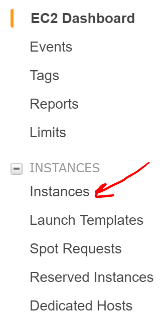
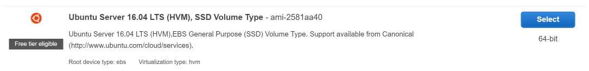
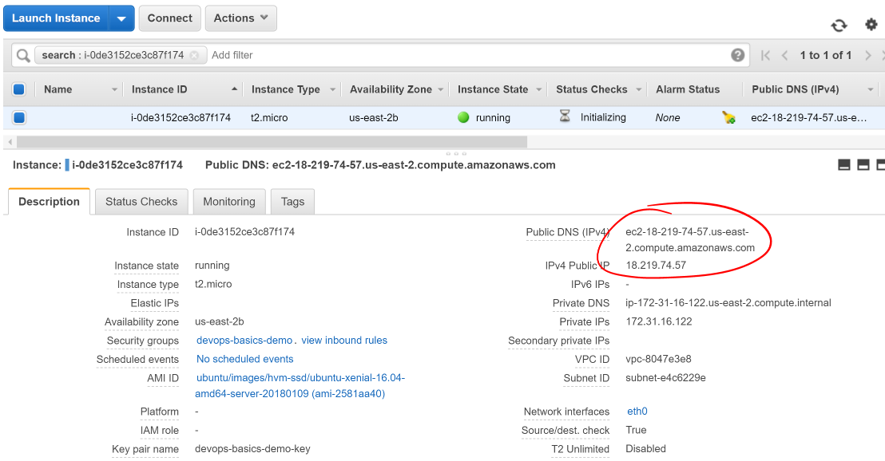
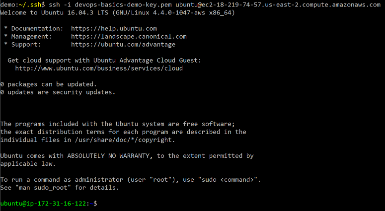

## Overview

Your goal is to deploy a Spring Boot project to a remote server and verify its execution. This will establish the basics for working in a cloud environment.

## Set Up Project

- Build your latest branch of [Airwaze Studio project](https://gitlab.com/LaunchCodeTraining/airwaze-studio) or check out and build the `elasticsearch-starter` branch.
- Change `src/main/resources/import.sql` to:
```nohighlight
COPY route(src, src_id, dst, dst_id, airline, route_geom) from '/home/airwaze/routes.csv' DELIMITER ',' CSV HEADER;
COPY airport(airport_id, name, city, country, faa_code, icao, altitude, time_zone, airport_lat_long) from '/home/airwaze/Airports.csv' DELIMITER ',' CSV HEADER;
```

- Go into IntelliJ's Gradle tool window, and click on `Tasks > build > bootRepackage`.
- Verify the jar appears in `build/libs`

## Start an Instance on AWS

1. Go to the EC2 Dashboard:
    - Click on `Services` in the page header.
    - Locate and click on `EC2` under **Compute**.


2. On the EC2 Dashboard
    - Locate and click the `Instances` link in the sidebar



3. On the Instances screen
    - Locate and click the `Launch Instance` button at the top of the page


## Starting an AWS Instance

When creating a new instance, Amazon provides multiple free **Amazon Machine Images** (AMIs) to choose from. This is a pre-configured operating system installation with multiple tools ready for use. For this exercise, we want to use the **Ubuntu Server 16.04 LTS** AMI. Locate it in the list of "Quick Start" images and click its `Select` button.



### Instace Details
Next, the console will ask which type of instance to set up. Your choice here defines the amount of virtual CPU cores, RAM, and network perforance you want. This also directly affects the cost of the running instance. Select the `t2.micro` service, then click **Configure Instance Details**.


The following screen allows for configuration of instance. We do not need to customize this image beyond the defaults, so you can continue to **Add Storage**.

### Storage
On this screen, you can choose what storage is available to your instance. AWS will provision a virtual volume in Elastic Block Store to serve as the volume(s) mounted in your instance. By default, it will create an 8 GiB volume to serve as the instance's root volume. The default 8 GiB volume is sufficient for this application. Click on "Add Tags" to progress to the next step.


### Add Tags
The **Add Tags** screen is helpful to "name" our ec2 instance. Since lots of us are going to be creating instances, please click **Add Tag** add a `Name` tag with a value of something unique and relevant to you, example `blakes-ec2-walkthrough`. Then click **Configure Security Group**.


### Security Groups
Configuring the security groups for your server is critical for protecting your instance from unauthorized remote access. You are liable for the work and costs generated by your instance, well in this case LaunchCode is ;). An openly-accessible instance can risk your infrastructure security and accumulate great costs to your organization if it were to be compromised.
  - Create a new security group for your instance with a unique name
  - Add a useful description for the security group so you know its purpose in the future
  - Change the existing rule's source to "My IP"
    - This allows remote SSH access to your instance, but only from the IP you're currently using to access AWS
    - NOTE: This is your IP at the time of configuration. Later on if your IP changes for some reason you will NOT be able to login until you adjust the 
    security group to look for your new IP.
  - Continue to **Review and Launch**


### Review Screen
This screen gives you a final chance to review and change the settings you chose for this instance. Open the dropdowns on the screen and when you're ready, click **Launch**.

### Setting up a KeyPair

This will open a popup on the screen that allows you to configure a key pair for the instance. This will generate the key necessary to SSH into the instance and without this you will not be able to access your instance. In an enterprise environment, there will likely already be multiple key pairs set up that you would use here. For the purpose of this project, create a new key pair:
  - Select "Create a new key pair" in the first select box
  - Give your key pair a good name, possibly the same name you gave your security group
  - Click "Download Key Pair"
  - Store this `*.pem` file in a good location and do not lose it
  - Click **Launch Instances**

### Your Instance Details
AWS will now begin launching your instance. After Launching your instance will be availabe in the list of EC2 Instances. You can click the identifier for your instance to monitor it as it starts up. This will take you back to the Instances dashboard. In the **Description** tab of your instance you can see important properties such as `public DNS`, `IP`, `running state`, `instance type`, `links to security group(s)`, `key pair`, etc.



### Set up SSH

- Open the terminal.
- Navigate to your user's ssh configuration folder:
```nohighlight
$ cd ~/.ssh
```
- Copy your instance's \*.pem file to your .ssh folder:
```nohighlight
$ cp /path/to/*.pem .
```
- Change the permissions for this file to read-only by your user:
```nohighlight
$ chmod 400 name-of-pem.pem
```
- Using the Public DNS you noted before and your \*.pem file, access your AWS instance:
```nohighlight
$ ssh -i ~/.ssh/name-of-pem.pem ubuntu@insert-public-DNS-here
```

<aside class="aside-note" markdown="1">
  Note the `ubuntu` part of the above command is the user/role you are attempting to connect with on the remote computer.
</aside>

- The ssh program will likely warn that the authenticity of your host can't be established since it's not seen it before. Respond "yes" to continue connecting. It will add it to the list of known hosts and continue the connection process.
- The remote terminal will appear



Congratulations! You have successfully created and connected to an instance running in the cloud.

### Running Your Application In the Cloud

Now that you have a server running in the cloud, you need to use it to do some work. Let's prepare the server to run our application.

### Create Application User
First, you don't want the application running under your system account, so we need to create a new user with a password:
```nohighlight
(On remote server)
$ sudo adduser airwaze
```

### Secure Copy Files to Server
Next, go to a terminal prompt for **your local machine**, upload the Airwaze Studio jar to the server. We'll use scp to securely transmit the file to our server. We will copy the jar file and the csv files.
```nohighlight
(On local computer)
$ scp -i ~/.ssh/name-of-pem.pem /path/to/local/app.jar ubuntu@ec2-public-dns.us-east-2.compute.amazonaws.com:/home/ubuntu/app.jar
$ scp -i ~/.ssh/name-of-pem.pem /path/to/local/routes.csv ubuntu@ec2-public-dns.us-east-2.compute.amazonaws.com:/home/ubuntu/routes.csv
$ scp -i ~/.ssh/name-of-pem.pem /path/to/local/Airports.csv ubuntu@ec2-public-dns.us-east-2.compute.amazonaws.com:/home/ubuntu/Airports.csv
```
Now log in to the server (if you don't still have an open connection):
```nohighlight
(On local computer)
$ ssh -i ~/.ssh/name-of-pem.pem ubuntu@ec2-public-dns.us-east-2.compute.amazonaws.com
```
### Install JDK on Server
The remotes servers will not come with everything we need already isntalled.  We need Java to be to run our app.
```nohighlight
(On remote server)
$ sudo apt-get update
$ sudo apt-get install openjdk-8-jdk
$ java -version
```
### Copy Files to App User Folder
Now, on the server, move the file to the airwaze home directory, and make it owned and executable by that user. Notice the changes in `ls -l` after the owner and permissions calls are made.
```nohighlight
(On remote server)
$ sudo mv ~/app.jar /home/airwaze/app.jar
$ sudo mv ~/*.csv /home/airwaze
$ cd /home/airwaze
$ ls -l
$ sudo chown -R airwaze:airwaze /home/airwaze
$ ls -l
$ sudo chmod 500 /home/airwaze/app.jar
$ ls -l
```
Now the airwaze user can execute app.jar.
```nohighlight
-rw-r--r-- 1 airwaze airwaze   881432 May 20 01:23 Airports.csv
-r-x------ 1 airwaze airwaze 46309179 May 20 01:22 app.jar
-rw-r--r-- 1 airwaze airwaze  6464492 May 20 01:23 routes.csv
```
### Install Postgis
Before trying to start the application, we'll install `postgres` locally so we can start Airwaze Studio. **This is something you would *never* do in a real cloud instance**, but we'll do it just for this demonstration so our app will start.
```nohighlight
(On remote server)
$ sudo apt-get update
$ sudo apt-get install postgresql postgresql-contrib postgis
$ sudo -u postgres createuser --pwprompt airwaze_app_user # give password `somethingsensible`
$ sudo -u postgres createdb -O airwaze_app_user airwaze
$ sudo vim /etc/postgresql/9.5/main/pg_hba.conf
```
When the configuration file comes up, you'll see that almost all of the lines are commented out.  Towards the bottom you find lines that are not commented out.  Press `i` to get into Insert mode, and change the line with `local all all peer` to `local all all md5`.  When you're done, press `escape` to get out of insert mode.  Press `:` to bring up a prompt, then press `w` (for 'write') and `q` (for 'quit'), followed by `return`.

```nohighlight
# "local" is for Unix domain socket connections only
local   all             all                                     md5
```

### Install Postgis Extentions
```nohighlight
(On remote server)
$ sudo /etc/init.d/postgresql restart
$ sudo -u postgres psql airwaze
CREATE EXTENSION postgis;
CREATE EXTENSION postgis_topology;
CREATE EXTENSION fuzzystrmatch;
CREATE EXTENSION postgis_tiger_geocoder;
ALTER USER airwaze_app_user SUPERUSER;
```

### Setup Service for App
Now that the app is on the cloud server and the database is ready, we can set up `systemd` to run this app as a service.

In order to use `systemd`, we have to make a script in `/etc/systemd/system` to tell the service how to run our app.
```nohighlight
(On remote server)
$ sudo vim /etc/systemd/system/airwaze.service
```
Press `i` to start inserting text into the file and paste the following:
```nohighlight
[Unit]
Description=Airwaze Studio
After=syslog.target

[Service]
User=airwaze
ExecStart=/usr/bin/java -jar /home/airwaze/app.jar SuccessExitStatus=143
Restart=always

[Install]
WantedBy=multi-user.target
```
Once this service definition is in place, set the service to start automatically on boot with systemd using the `systemctl` utility and also start now:
```nohighlight
(On remote server)
$ sudo systemctl enable airwaze
$ sudo systemctl start airwaze
```
And you can view the logs for the service with `journalctl`.
```nohighlight
(On remote server)
$ journalctl -f -u airwaze.service
```

### Configure Security Group
Now that your application is running, open up a new port in our Security Group from before to allow for web communications.
- Return to the AWS web console
- Click `Security Groups` in the sidebar


- Select the security group with the name you used before


- Click the `Inbound` tab and `Edit` the inbound traffic list


- Add a new `Custom TCP` rule for port 8080 and select `My IP` for the source


- Click `Save`
This opens up a new port in the Security Group just for your IP. The Airwaze app is set up to listen to port 8080 and communicating with that port from your browser will allow you to communicate with the application.
- Open your browser
- Go to your server on port 8080:
  - http://ec2-public-dns.us-east-2.compute.amazonaws.com:8080


If you kept `journalctl` running from before, you should see the logs progress as your browser communicates with the app.

### Where are the Features?
If you see a map, but don't see any features it's likely due to the fact that your layer source is pointing to `url: http://localhost:8080/airport/` which refers to your computer. You need to change the url to refer to the remote server by using a reletive url `url: /airport/`. You will need to `scp` the jar file back up and start and stop the service for your changes to appear.

Congratulations! You now have your own application in the cloud!

## Next Steps

Your map is currently showing up on the screen; however, the map is not showing any airports.  Troubleshoot the application and figure out why the airports are not showing up.  Be sure to use your browser's developer tools. 

When you have found the problem, build a new copy of your jar and deploy it on your server. 

## Bonus Mission

* Use Environment Variables to dynamically change the port that your application is served on.

* Using the instructions above, deploy another one of your SpringBoot application to AWS.  Consider using the [LaunchCart Project](https://gitlab.com/LaunchCodeTraining/launchcart/tree/rest-studio).  


