+---
+title: "Studio: Load Balanced Cloud"
+---

## Project

## Overview

This studio will expand on what was learned in the AWS basics unit. Your goal is create a load-balanced cloud-based application using good AWS Dev Ops practices.

## Prepare the Code

- Start with the corrected code you finished with in the last studio
- Open the `application.properties` file, find and change the following lines:
```nohighlight
spring.datasource.url=jdbc:postgresql://${APP_DB_HOST}:${APP_DB_PORT}/${APP_DB_NAME}
spring.datasource.username=${APP_DB_USER}
spring.datasource.password=${APP_DB_PASS}
# spring.jpa.hibernate.ddl-auto = create
```
- Go into IntelliJ's Gradle tool window, and click on `Tasks > build > bootRepackage`.
- Verify the jar appears in `build/libs`

## Provision a VPC

In order to isolate your application instances from other instances in AWS, you need to create a Virtal Private Cloud (VPC). This gives you your own little private network in the cloud which can help when establishing access controls as well as keeping your instances private from the rest of AWS. Typically, you'll have a few of these in an enterprise environment to keep strict boundaries between unrelated services.

- Click "Services" in the header and locate "VPC" under "Networking & Content Delivery"


- When you arrive on the VPC dashboard, click "Start VPC Wizard"

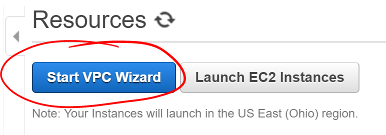

- For this studio, select the simplest VPC configuration - a single public subnet. This allows your instances to connect to the internet without an intermediary.
  - Some VPCs will have private subnets that require a Network Address Translator (NAT) instance to serve as a gateway for private services to connect to the internet and outside services.
  - Other configurations allow (or require) a VPN connection and can serve as an extension of a private data center.

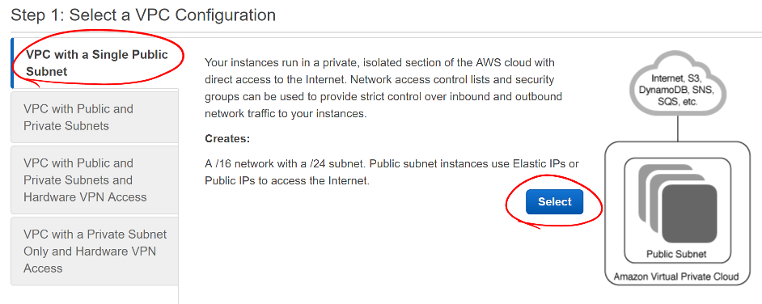

- When creating the VPC, the defaults are sufficient for your needs. Provide a useful VPC name to help identify this VPC among the others.
- Note the IPv4 CIDR block. This defines the IP addresses that will be available in your VPC. (See [Wikipedia's CIDR table](https://en.wikipedia.org/wiki/Classless_Inter-Domain_Routing#IPv4_CIDR_blocks).) A `x.x.x.x/16` block will include 65,536 addresses.
- The Public subnet's IPv4 CIDR will be `x.x.x.x/24`, which includes 256 addresses. This is the subnet where you'll put your public-facing instances (such as your Airwaze app).

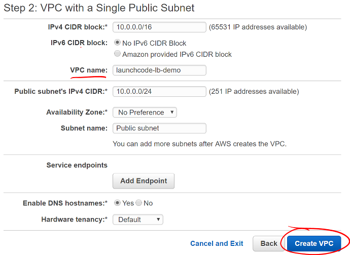

- After creating the VPC, make sure to note the `VPC ID` of your VPC as that name will appear everywhere you will select it later.
  - Not every AWS web interface includes the descriptive name you gave before.

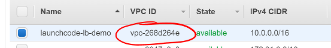

- Next, you need to create two private subnets for your RDS instance. Select "Subnets" in the VPC Dashboard sidebar.

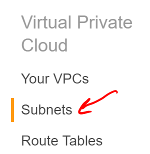

- On the Subnet dashboard page, click the "Create Subnet" button.


- To create the subnet, give it a descriptive name to help identify it later.
- Select your VPC from the VPC select list
- Select one of the availablity zones for your region
- Create a new CIDR block for this private subnet
  - Remember, if you use a `x.x.x.x/24` subnet, that will contain 256 addresses, so increase the third number by one from the previously created subnet.
- Do this twice, with a different availability zone and CIDR block for both subnets.

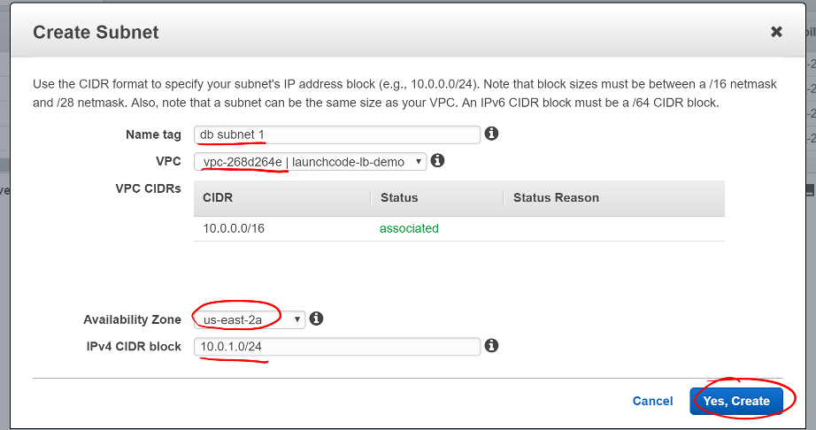

## Set Up RDS

Now that the VPC is set up and ready for use, you need to create your database server. In the last studio, you installed a PostgreSQL server on your instance. This time, we'll use AWS's Relational Database Service (RDS) to host and manage our DB instance.

- Click "Services" in the header and select "Relational Database Service"

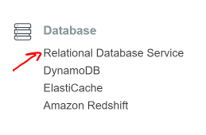

- Before creating any instances, you need to create a DB Subnet Group so AWS knows where to place your instance. Select "Subnet groups" in the RDS Dashboard sidebar.

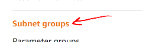

- On the Subnet Groups Dashboard, click the "Create DB Subnet Group" button.

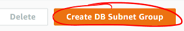

- Enter a useful subnet group name and description, then select your VPC.

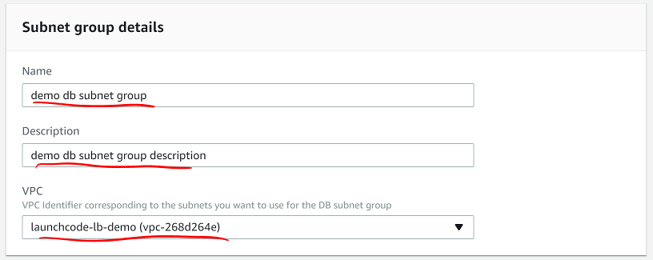

- After selecting your VPC, select an availability zone you used above and select a subnet you created in that zone. Click "Add subnet".
- Do this for both subnets you created above.
- Click the "Create" button

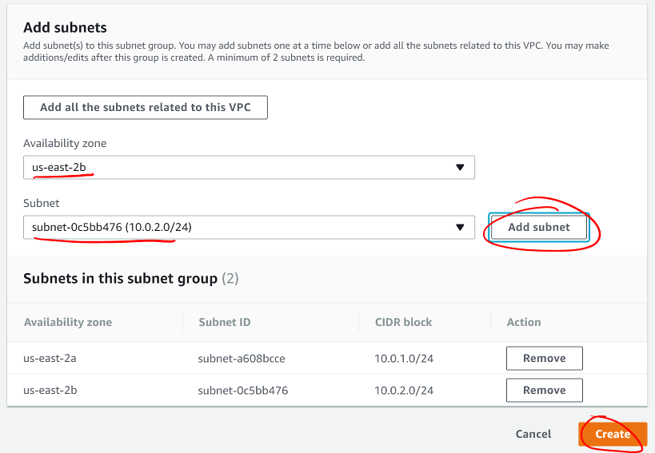

Now that you've created the database subnets, you need to create a database instance for your application to use.

- Return to the RDS Dashboard
- Scroll down and click the "Launch a DB instance" button.
- For Airwaze, you will use a PostgreSQL database. Select that and click "Next".

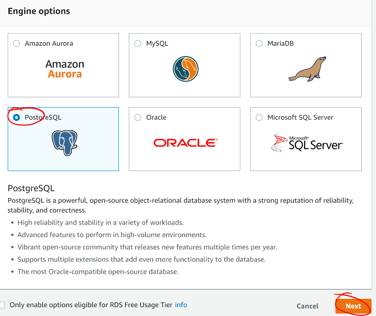

- AWS will next ask you how you plan to use the database. Production-ready databases will have multiple availability zone redundancy and higher-speed storage options, but are also more expensive. Select "Dev/Test" to access the lower-powered options then click "Next"

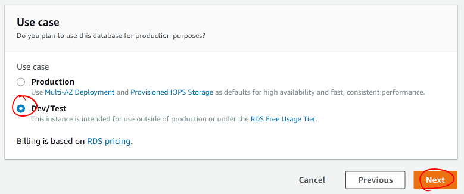

- Make sure the DB engine version matches the version of PostgreSQL you need to use.
- Select `db.t2.micro` instance class. This is the smallest, slowest, and least-expensive instance option for RDS.
- For this studio, select "No" for a Multi-AZ deployment. In a production environment, this is an important option to ensure the database is always accessible. For this studio, you do not need this.
- The studio database is very small. Use the smallest storage option.

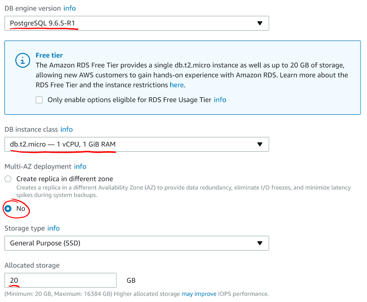

Next, you'll set up the instance's identifier and master user account. Do not set up the application user as the master user. That would introduce a security risk for your database and data if your application were to be compromised. We will set up a separate DB user account later.

- Give your DB instance a useful name in the `DB instance identifier` field.
- Make a master username that is difficult to guess, but easy for you to remember.
- Use a secure password for your master user.
- Click "Next".

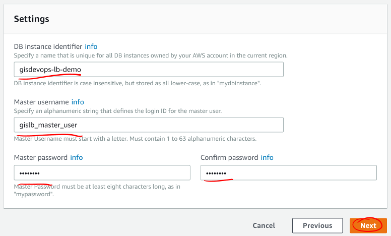

Here you'll indicate where RDS should place your instance and how to secure it.

- Select your VPC
- Select the DB Subnet Group you made above
- Do not make your DB publicly accessible. For security, you should limit the services that can be accessed from outside your VPC.

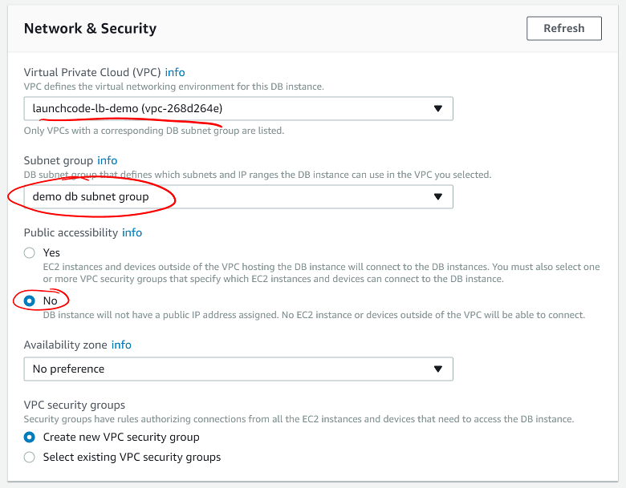

- Set up your desired database name and port.
- Keep the default DB parameter group.
- Then click "Launch DB instance".

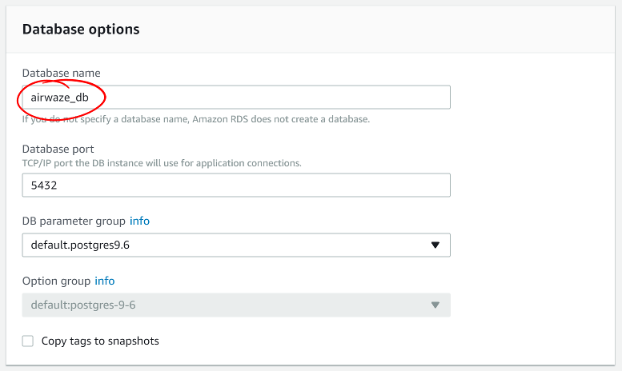

RDS will start creating a DB instance, security groups, and your master user and database. Return to the RDS Instances dashboard and select your instance. Scroll down to the "Connect" section. Your Endpoint will appear here when the instance is ready. Note this endpoint address.

You'll also see the security group inbound and outbound rules set up. If the inbound rule doesn't match your VPC's subnet CIDR, change that by clicking the gear icon to the right of `Security group rules`.

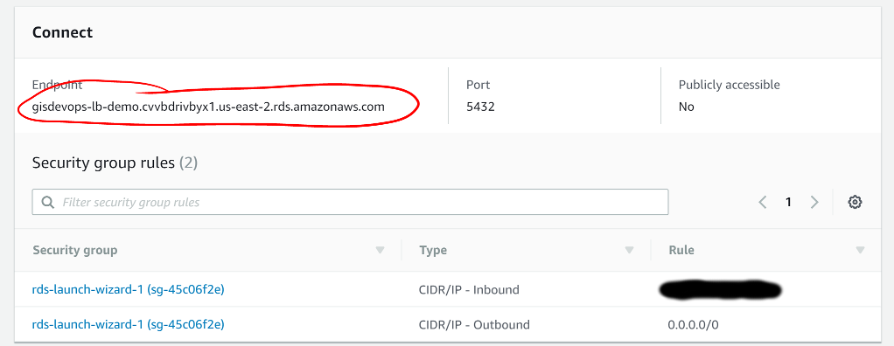

- Select the "Inbound" rules tab and click "Edit".

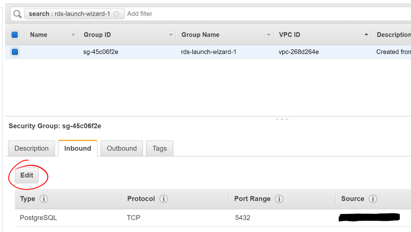

- Find the PostgreSQL port line and change the Source to your VPC subnet CIDR.
  - This will allow traffic from all instances in your VPC, but not from the outside world.
- Click "Save".

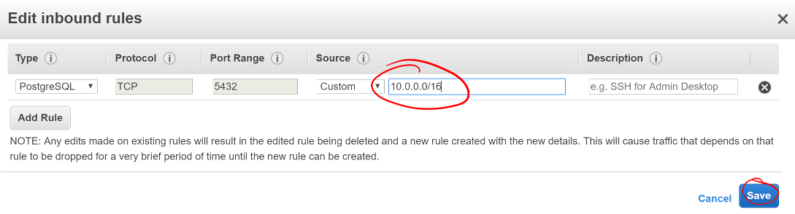


## Make a Custom Snapshot

Spin up one EC2 machine
Load psql and load data to db
Set up and connect to DB
Take Snapshot
Configure firewall to allow SSH and HTTP access.

Build a new instance

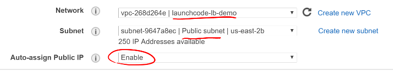

User Data

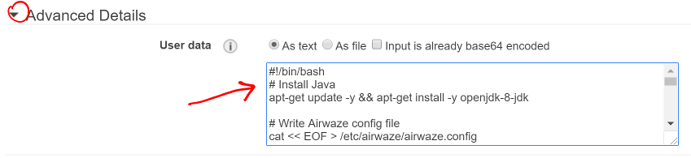

```nohighlight
#!/bin/bash
# Install Java
apt-get update -y && apt-get install -y openjdk-8-jdk

useradd -M airwaze
mkdir /opt/airwaze
mkdir /etc/opt/airwaze
chown -R airwaze:airwaze /opt/airwaze /etc/opt/airwaze
chmod 777 /opt/airwaze

# Write Airwaze config file
cat << EOF > /etc/opt/airwaze/airwaze.config
APP_DB_HOST=gisdevops-lb-demo.cvvbdrivbyx1.us-east-2.rds.amazonaws.com
APP_DB_PORT=5432
APP_DB_NAME=airwaze_db
APP_DB_USER=airwaze_user
APP_DB_PASS=verysecurepassword
EOF

# Write systemd unit file
cat << EOF > /etc/systemd/system/airwaze.service
[Unit]
Description=Airwaze Studio
After=syslog.target

[Service]
User=airwaze
EnvironmentFile=/etc/opt/airwaze/airwaze.config
ExecStart=/usr/bin/java -jar /opt/airwaze/app.jar SuccessExitStatus=143
Restart=always

[Install]
WantedBy=multi-user.target
EOF

systemctl enable airwaze.service
```
scp -i ~/.ssh/aws-ssh-key.pem airwaze-application.jar ubuntu@ec2-instance.us-east-2.compute.amazonaws.com:/opt/airwaze/app.jar
ssh -i ~/.ssh/aws-ssh-key.pem ubuntu@ec2-instance.us-east-2.compute.amazonaws.com
chmod 555 /opt/airwaze/app.jar

```
sudo apt-get update
sudo apt-get install postgresql
psql -h rds-instance.us-east-2.rds.amazonaws.com -p 5432 -U rds_master_user airwaze_db

create user airwaze_user with password 'verysecurepassword';

CREATE EXTENSION postgis;
CREATE EXTENSION postgis_topology;
CREATE EXTENSION fuzzystrmatch;
CREATE EXTENSION postgis_tiger_geocoder;

CREATE TABLE airport
(
    id serial primary key,
    airport_id integer,
    airport_lat_long geometry,
    altitude integer,
    city character varying(255),
    country character varying(255),
    faa_code character varying(255),
    icao character varying(255),
    name character varying(255),
    time_zone character varying(255)
);

CREATE TABLE route
(
    id serial primary key,
    airline character varying(255),
    airline_id integer,
    dst character varying(255),
    dst_id integer,
    route_geom geometry,
    src character varying(255),
    src_id integer
);

ALTER TABLE airport OWNER to airwaze_user;
ALTER TABLE route OWNER to airwaze_user;

psql -h rds-instance.us-east-2.rds.amazonaws.com -d airwaze_db -U airwaze_user -c "\copy route(src, src_id, dst, dst_id, airline, route_geom) from STDIN DELIMITER ',' CSV HEADER" < /home/ubuntu/routes.csv
psql -h rds-instance.us-east-2.rds.amazonaws.com -d airwaze_db -U airwaze_user -c "\copy airport(airport_id, name, city, country, faa_code, icao, altitude, time_zone, airport_lat_long) from STDIN DELIMITER ',' CSV HEADER" < /home/ubuntu/Airports.csv
sudo apt-get remove postgresql
sudo systemctl start airwaze.service
```

Set up as we did yesterday


## Set Up Load Balancing

Spin up a second EC2 machine based on the server snapshot.
Provision an ElasticLoadBalancer in front of the two EC2 machines.
Test traffic balancing.  Test one app going down.

## Bonus Mission

Bonus: Provision an SSH bastion and make the application servers only accessible via http.
