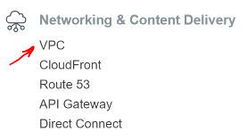

+---
+title: "Studio: Load Balanced Cloud"
+---

## Project

## Overview

This studio will expand on what was learned in the AWS basics unit. Your goal is create a load-balanced cloud-based application using good AWS Dev Ops practices.

## Prepare the Code

- Start with the corrected code you finished with in the last studio
- Open the `application.properties` file, find and change the following lines:
```nohighlight
spring.datasource.url=jdbc:postgresql://${APP_DB_HOST}:${APP_DB_PORT}/${APP_DB_NAME}
spring.datasource.username=${APP_DB_USER}
spring.datasource.password=${APP_DB_PASS}
# spring.jpa.hibernate.ddl-auto = create
```
- Go into IntelliJ's Gradle tool window, and click on `Tasks > build > bootRepackage`.
- Verify the jar appears in `build/libs`

## Provision a VPC




## Set Up RDS


## Make a Custom Snapshot

Spin up one EC2 machine
Load psql and load data to db
Set up and connect to DB
Take Snapshot
Configure firewall to allow SSH and HTTP access.

Build a new instance


User Data


```nohighlight
#!/bin/bash
# Install Java
apt-get update -y && apt-get install -y openjdk-8-jdk

useradd -M airwaze
mkdir /opt/airwaze
mkdir /etc/opt/airwaze
chown -R airwaze:airwaze /opt/airwaze /etc/opt/airwaze
chmod 777 /opt/airwaze

# Write Airwaze config file
cat << EOF > /etc/opt/airwaze/airwaze.config
APP_DB_HOST=gisdevops-lb-demo.cvvbdrivbyx1.us-east-2.rds.amazonaws.com
APP_DB_PORT=5432
APP_DB_NAME=airwaze_db
APP_DB_USER=airwaze_user
APP_DB_PASS=verysecurepassword
EOF

# Write systemd unit file
cat << EOF > /etc/systemd/system/airwaze.service
[Unit]
Description=Airwaze Studio
After=syslog.target

[Service]
User=airwaze
EnvironmentFile=/etc/opt/airwaze/airwaze.config
ExecStart=/usr/bin/java -jar /opt/airwaze/app.jar SuccessExitStatus=143
Restart=always

[Install]
WantedBy=multi-user.target
EOF

systemctl enable airwaze.service
```
scp -i ~/.ssh/aws-ssh-key.pem airwaze-application.jar ubuntu@ec2-instance.us-east-2.compute.amazonaws.com:/opt/airwaze/app.jar
ssh -i ~/.ssh/aws-ssh-key.pem ubuntu@ec2-instance.us-east-2.compute.amazonaws.com
chmod 555 /opt/airwaze/app.jar

```
sudo apt-get update
sudo apt-get install postgresql
psql -h rds-instance.us-east-2.rds.amazonaws.com -p 5432 -U rds_master_user airwaze_db

create user airwaze_user with password 'verysecurepassword';

CREATE EXTENSION postgis;
CREATE EXTENSION postgis_topology;
CREATE EXTENSION fuzzystrmatch;
CREATE EXTENSION postgis_tiger_geocoder;

CREATE TABLE airport
(
    id serial primary key,
    airport_id integer,
    airport_lat_long geometry,
    altitude integer,
    city character varying(255),
    country character varying(255),
    faa_code character varying(255),
    icao character varying(255),
    name character varying(255),
    time_zone character varying(255)
);

CREATE TABLE route
(
    id serial primary key,
    airline character varying(255),
    airline_id integer,
    dst character varying(255),
    dst_id integer,
    route_geom geometry,
    src character varying(255),
    src_id integer
);

ALTER TABLE airport OWNER to airwaze_user;
ALTER TABLE route OWNER to airwaze_user;

psql -h rds-instance.us-east-2.rds.amazonaws.com -d airwaze_db -U airwaze_user -c "\copy route(src, src_id, dst, dst_id, airline, route_geom) from STDIN DELIMITER ',' CSV HEADER" < /home/ubuntu/routes.csv
psql -h rds-instance.us-east-2.rds.amazonaws.com -d airwaze_db -U airwaze_user -c "\copy airport(airport_id, name, city, country, faa_code, icao, altitude, time_zone, airport_lat_long) from STDIN DELIMITER ',' CSV HEADER" < /home/ubuntu/Airports.csv
sudo apt-get remove postgresql
sudo systemctl start airwaze.service
```

Set up as we did yesterday


## Set Up Load Balancing

Spin up a second EC2 machine based on the server snapshot.
Provision an ElasticLoadBalancer in front of the two EC2 machines.
Test traffic balancing.  Test one app going down.

## Bonus Mission

Bonus: Provision an SSH bastion and make the application servers only accessible via http.
