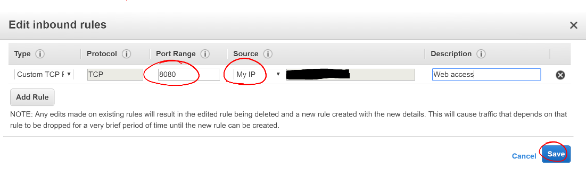
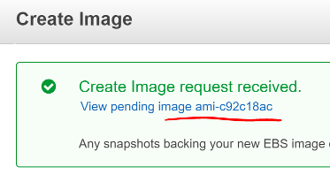
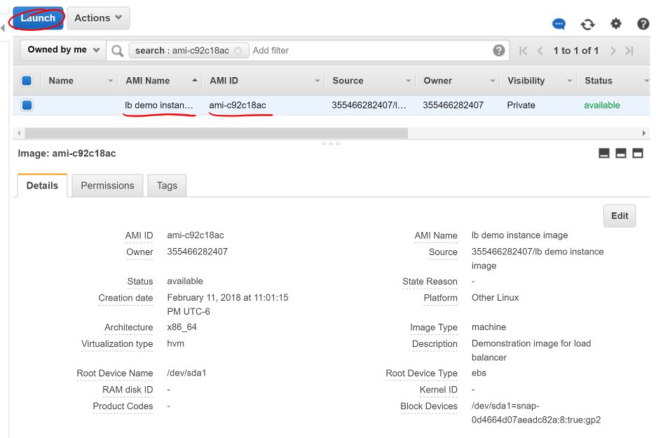
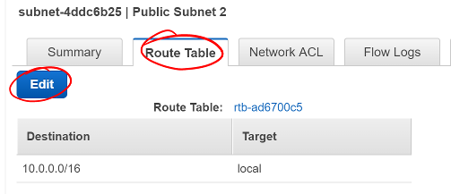
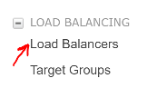
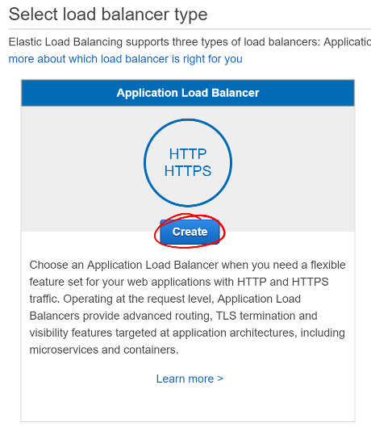
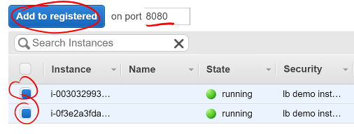
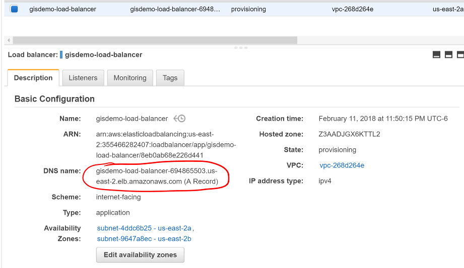
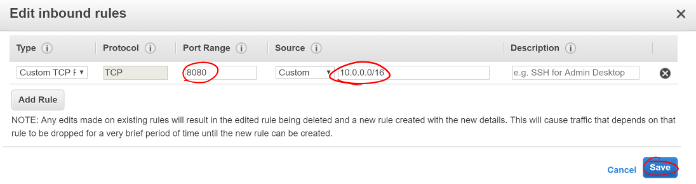

+---
+title: "Studio: Load Balanced Cloud"
+---

## Project

## Overview

This studio will expand on what was learned in the AWS basics unit. Your goal is create a load-balanced cloud-based application using good AWS Dev Ops practices.

## Prepare the Code

- Start with the corrected code you finished with in the last studio
- Open the `application.properties` file, find and change the following lines:
```nohighlight
spring.datasource.url=jdbc:postgresql://${APP_DB_HOST}:${APP_DB_PORT}/${APP_DB_NAME}
spring.datasource.username=${APP_DB_USER}
spring.datasource.password=${APP_DB_PASS}
# spring.jpa.hibernate.ddl-auto = create
```
- Go into IntelliJ's Gradle tool window, and click on `Tasks > build > bootRepackage`.
- Verify the jar appears in `build/libs`

## Provision a VPC

In order to isolate your application instances from other instances in AWS, you need to create a Virtal Private Cloud (VPC). This gives you your own little private network in the cloud which can help when establishing access controls as well as keeping your instances private from the rest of AWS. Typically, you'll have a few of these in an enterprise environment to keep strict boundaries between unrelated services.

- Click "Services" in the header and locate "VPC" under "Networking & Content Delivery"


- When you arrive on the VPC dashboard, click "Start VPC Wizard"


- For this studio, select the simplest VPC configuration - a single public subnet. This allows your instances to connect to the internet without an intermediary.
  - Some VPCs will have private subnets that require a Network Address Translator (NAT) instance to serve as a gateway for private services to connect to the internet and outside services.
  - Other configurations allow (or require) a VPN connection and can serve as an extension of a private data center.


- When creating the VPC, the defaults are sufficient for your needs. Provide a useful VPC name to help identify this VPC among the others.
- Note the IPv4 CIDR block. This defines the IP addresses that will be available in your VPC. (See [Wikipedia's CIDR table](https://en.wikipedia.org/wiki/Classless_Inter-Domain_Routing#IPv4_CIDR_blocks).) A `x.x.x.x/16` block will include 65,536 addresses.
- The Public subnet's IPv4 CIDR will be `x.x.x.x/24`, which includes 256 addresses. This is the subnet where you'll put your public-facing instances (such as your Airwaze app).


- After creating the VPC, make sure to note the `VPC ID` of your VPC as that name will appear everywhere you will select it later.
  - Not every AWS web interface includes the descriptive name you gave before.


- Next, you need to create two private subnets for your RDS instance. Select "Subnets" in the VPC Dashboard sidebar.


- On the Subnet dashboard page, click the "Create Subnet" button.


- To create the subnet, give it a descriptive name to help identify it later.
- Select your VPC from the VPC select list
- Select one of the availablity zones for your region
- Create a new CIDR block for this private subnet
  - Remember, if you use a `x.x.x.x/24` subnet, that will contain 256 addresses, so increase the third number by one from the previously created subnet.
- Do this twice, with a different availability zone and CIDR block for both subnets.


## Set Up RDS

Now that the VPC is set up and ready for use, you need to create your database server. In the last studio, you installed a PostgreSQL server on your instance. This time, you'll use AWS's Relational Database Service (RDS) to host and manage our DB instance.

- Click "Services" in the header and select "Relational Database Service"


- Before creating any instances, you need to create a DB Subnet Group so AWS knows where to place your instance. Select "Subnet groups" in the RDS Dashboard sidebar.


- On the Subnet Groups Dashboard, click the "Create DB Subnet Group" button.


- Enter a useful subnet group name and description, then select your VPC.


- After selecting your VPC, select an availability zone you used above and select a subnet you created in that zone. Click "Add subnet".
- Do this for both subnets you created above.
- Click the "Create" button


Now that you've created the database subnets, you need to create a database instance for your application to use.

- Return to the RDS Dashboard
- Scroll down and click the "Launch a DB instance" button.
- For Airwaze, you will use a PostgreSQL database. Select that and click "Next".


- AWS will next ask you how you plan to use the database. Production-ready databases will have multiple availability zone redundancy and higher-speed storage options, but are also more expensive. Select "Dev/Test" to access the lower-powered options then click "Next"


- Make sure the DB engine version matches the version of PostgreSQL you need to use.
- Select `db.t2.micro` instance class. This is the smallest, slowest, and least-expensive instance option for RDS.
- For this studio, select "No" for a Multi-AZ deployment. In a production environment, this is an important option to ensure the database is always accessible. For this studio, you do not need this.
- The studio database is very small. Use the smallest storage option.


Next, you'll set up the instance's identifier and master user account. Do not set up the application user as the master user. That would introduce a security risk for your database and data if your application were to be compromised. You will set up a separate DB user account later.

- Give your DB instance a useful name in the `DB instance identifier` field.
- Make a master username that is difficult to guess, but easy for you to remember.
- Use a secure password for your master user.
- Click "Next".


Here you'll indicate where RDS should place your instance and how to secure it.

- Select your VPC
- Select the DB Subnet Group you made above
- Do not make your DB publicly accessible. For security, you should limit the services that can be accessed from outside your VPC.


- Set up your desired database name and port.
- Keep the default DB parameter group.
- Then click "Launch DB instance".


RDS will start creating a DB instance, security groups, and your master user and database. Return to the RDS Instances dashboard and select your instance. Scroll down to the "Connect" section. Your Endpoint will appear here when the instance is ready. Note this endpoint address.

You'll also see the security group inbound and outbound rules set up. If the inbound rule doesn't match your VPC's subnet CIDR, change that by clicking the gear icon to the right of `Security group rules`.


- Select the "Inbound" rules tab and click "Edit".


- Find the PostgreSQL port line and change the Source to your VPC subnet CIDR.
  - This will allow traffic from all instances in your VPC, but not from the outside world.
- Click "Save".


## Make a Custom Snapshot

Now that you have created your database, you need to create an instance to connect to it as our template. If you need review on creating an EC2 instance, please see the previous lesson and studio.

You'll follow the same steps as before, with a few changes that are described here.

- On the "Configure Instance Details" screen while creating your instance:
  - Select your VPC in the "Network" selection
  - Select your Public subnet
  - Enable auto-assigning a Public IP


- At the bottom of the "Configure Instance Details" screen is a collapsed area called "Advanced Details". Click the text "Advanced Details" to expand this.
- You will see a "User data" section. This is an area to specify extra configuration AWS should perform when launching your instance. Below is a script to configure many things for your application:
  - Installs Java
  - Creates the `airwaze` system user
  - Creates the application and configuration directories
  - Writes the airwaze configuration file, which includes the environment variables for the application
  - Writes the `systemd` service file
  - Prepares the service for execution
- This script is run as `root`, so `sudo` is not needed for these commands. That also means you must be careful when crafting a script to run here.
- Copy this script in the "User data" section and adjust the `APP_DB_HOST` to your RDS instance's endpoint.


```nohighlight
#!/bin/bash
# Install Java
apt-get update -y && apt-get install -y openjdk-8-jdk

# Create airwaze user
useradd -M airwaze
mkdir /opt/airwaze
mkdir /etc/opt/airwaze
chown -R airwaze:airwaze /opt/airwaze /etc/opt/airwaze
chmod 777 /opt/airwaze

# Write Airwaze config file
cat << EOF > /etc/opt/airwaze/airwaze.config
APP_DB_HOST=rds-instance.us-east-2.rds.amazonaws.com
APP_DB_PORT=5432
APP_DB_NAME=airwaze_db
APP_DB_USER=airwaze_user
APP_DB_PASS=verysecurepassword
EOF

# Write systemd unit file
cat << EOF > /etc/systemd/system/airwaze.service
[Unit]
Description=Airwaze Studio
After=syslog.target

[Service]
User=airwaze
EnvironmentFile=/etc/opt/airwaze/airwaze.config
ExecStart=/usr/bin/java -jar /opt/airwaze/app.jar SuccessExitStatus=143
Restart=always

[Install]
WantedBy=multi-user.target
EOF

systemctl enable airwaze.service
```
- Continue through the steps to create the instance that you learned in the last lesson and studio.
- Once the instance is online, copy the Airwaze application jar and database initialization CSV files to the server.
- SSH to the instance and set the appropriate permissions on the jar.
```nohighlight
$ scp -i ~/.ssh/aws-ssh-key.pem airwaze-application.jar ubuntu@ec2-instance.us-east-2.compute.amazonaws.com:/opt/airwaze/app.jar
$ scp -i ~/.ssh/aws-ssh-key.pem routes.csv ubuntu@ec2-instance.us-east-2.compute.amazonaws.com:/home/ubuntu/routes.csv
$ scp -i ~/.ssh/aws-ssh-key.pem Airports.csv ubuntu@ec2-instance.us-east-2.compute.amazonaws.com:/home/ubuntu/Airports.csv

$ ssh -i ~/.ssh/aws-ssh-key.pem ubuntu@ec2-instance.us-east-2.compute.amazonaws.com
$ chmod 555 /opt/airwaze/app.jar
```

Now that you have your instance set up and ready, you need to log into the server to prepare your database and start the service. During development of the Airwaze studio application, it was set to reload the database on every start of the service. This is not something you want happening in your cloud environment. Instead, you'll create everything your application needs in your instance by hand.

- SSH to your instance, then install the `postgresql` client package.
- Connect to your RDS instance using the master account you created before.
```nohighlight
$ sudo apt-get update
$ sudo apt-get install postgresql
$ psql -h rds-instance.us-east-2.rds.amazonaws.com -p 5432 -U rds_master_user airwaze_db
```

- In the `psql` console, create:
  - The application's DB user
  - The postgis extensions
  - The data tables
- Then set your tables to be owned by your application's DB user.
```nohighlight
CREATE USER airwaze_user WITH PASSWORD 'verysecurepassword';

CREATE EXTENSION postgis;
CREATE EXTENSION postgis_topology;
CREATE EXTENSION fuzzystrmatch;
CREATE EXTENSION postgis_tiger_geocoder;

CREATE TABLE airport
(
    id serial primary key,
    airport_id integer,
    airport_lat_long geometry,
    altitude integer,
    city character varying(255),
    country character varying(255),
    faa_code character varying(255),
    icao character varying(255),
    name character varying(255),
    time_zone character varying(255)
);

CREATE TABLE route
(
    id serial primary key,
    airline character varying(255),
    airline_id integer,
    dst character varying(255),
    dst_id integer,
    route_geom geometry,
    src character varying(255),
    src_id integer
);

ALTER TABLE airport OWNER to airwaze_user;
ALTER TABLE route OWNER to airwaze_user;
```

Now that the tables are created, you need to fill them with data.

- Run the following commands to copy from your CSV files into the database.

```nohighlight
$ psql -h rds-instance.us-east-2.rds.amazonaws.com -d airwaze_db -U airwaze_user -c "\copy route(src, src_id, dst, dst_id, airline, route_geom) from STDIN DELIMITER ',' CSV HEADER" < /home/ubuntu/routes.csv

$ psql -h rds-instance.us-east-2.rds.amazonaws.com -d airwaze_db -U airwaze_user -c "\copy airport(airport_id, name, city, country, faa_code, icao, altitude, time_zone, airport_lat_long) from STDIN DELIMITER ',' CSV HEADER" < /home/ubuntu/Airports.csv
```

At this point, everything is ready to go on this instance. You no longer need (or want) to connect to the database directly so uninstall the `postgresql` client package. Then you may start the Airwaze service.
```nohighlight
$ sudo apt-get remove postgresql

$ sudo systemctl start airwaze.service
```

You can run `journalctl` as you learned in the previous studio to check the logs for your running service.

## Configure the Security Group

Now that your instance and service are running, return to the EC2 Security Group dashboard. Here you need to enable web access and remove SSH access. This will make your application usable to the world and decrease the risk of unintended access.

- Find and select your instance's security group
- Select the "Inbound" traffic tab and click "Edit".


- Change to "Custom TCP Rule"
- Enter port 8080
- Select "My IP" for Source
  - This is where you would typically make the port accessible to the world, but only you need to access the studio instance for now.
- Click "Save"



You may now try to access your application at http://ec2-instance.us-east-2.compute.amazonaws.com:8080 in your browser.

## Take a Snapshot

The benefit of the cloud is more than just having an application running on a single server in the cloud. You can make your application more resilient by having it run on multiple servers with a load balancer transferring traffic to the least-used server.

To facilitate spinning up more instances, you can take an image of your current instance to start others.

- Return to the EC2 Instances Dashboard.
- Select your instance.
- Above, click "Actions", then click "Image", then "Create Image"


- Give your image a useful name so you can find it again later
- Give your image a helpful description
- Ensure "No reboot" is **not** selected
  - Taking an image of a running instance is risky as it may catch it in the middle of writing to a file. Just leave this as "No reboot" unless there's a valid reason to not.
- Click "Create Image"


AWS will then shut down your instance, take an image of it, then restart it. Click the link in the confirmation dialog to montior the process of the image creation.



Once the image creation is complete, you can launch new instances with this image. Select your Amazon Machine Image (AMI) and click "Launch".



This will start the familiar instance creation process, but with your image rather than the "standard" Ubuntu image you've been using. As before, on "Configure Instance Details", select your VPC, public subnet, and assign a Public IP. This time, ***do not*** provide a User data script since this image already has the full configuration run.

After creating the instance, return to the EC2 Instances dashboard. Select your new instance and you'll see it was created from the image you created rather than the Ubuntu AMI used to create the previous one.


## Set Up Load Balancing

Create new public VPC subnet


Select route table



Switch to public route table, includes internet gateway


Select load balancers in sidebar



Select application load balancer



Create internet facing load balancer on port 80


Configure lb routing with new target group pointing to internal port 8080


Select public availablility zones for load balancer instance


Configure new security group for load balancer to accept open traffic on port 80


Select your application instances to register them to the lb



Monitor load balancer provisioning



Change appication instance security group to only allow traffic from within the VPC



Open http://demo-lb-instance.us-east-2.elb.amazonaws.com in the browser and see the application


Test traffic balancing.  Test one app going down.

## Bonus Mission

Bonus: Provision an SSH bastion and make the application servers only accessible via http.
