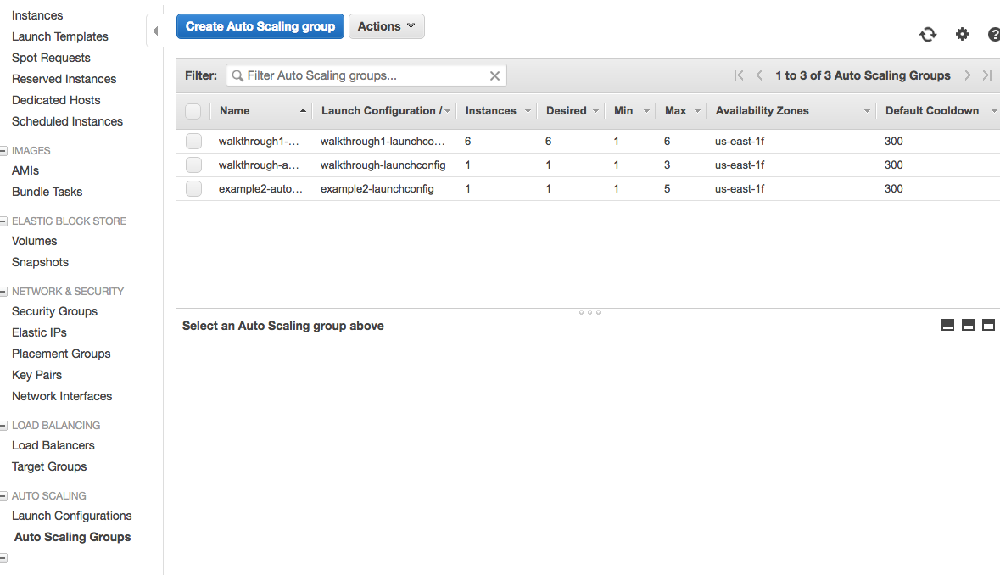

The ability to scale horizontally is very important in building Cloud Native applications.  In this studio, you will be extending your [Airwaze App](https://gitlab.com/LaunchCodeTraining/airwaze-studio) to scale horizontally as traffic on the server increases.

## Setup

For this studio, you should use the VPC that you built in the [Load Balanced Cloud Studio](../../studio/AWS2). 

We will be using the AWS CLI tool for some parts of the studio.  The AWS CLI tool allows you to create and change infrastructure on the cloud via the command line.  

To install the AWS CLI tool run the following commands. (You may need to add permissions to install awscli.)
```nohighlight
$ brew install awscli
$ echo 'complete -C aws_completer aws' >> ~/.bashrc
$ aws --version
```

Next configure the AWS CLI tool with your credentials.  These credentials can be found in *IAM > Users > You.* Click "Create Access Key".


<aside class="aside-note" markdown="1">
  It is very important that you keep the AWS Secret Access Key private.  Access to that key allows anyone to programmatically spin up infrastructure on the AWS account. 
</aside>

Next configure your the AWS CLI tool.  Use the "Default region name" or `us-east-2`:
```nohighlight
$ aws configure
AWS Access Key ID [None]: AK-------------------
AWS Secret Access Key [None]: r4------------------
Default region name [None]: us-east-2
Default output format [None]: 
```

For example, you should now be able to list all of the buckets in S3:
```nohighlight
$ aws s3 ls
```

### Configure Buckets

Since we are going to be horizontally scaling, we need machines to spin up automatically without any human interaction.  We are going to upload the executable jar file to S3 so that machines can pull down the file when they automatically spin up.

First create a new bucket in S3.  Remember **EVERY** bucket in S3 in the whole wide world has to be unique.  Use the pattern below to get a unique name.

```nohighlight
$ aws s3 mb s3://launchcode-gisdevops-c1-yourname/
```

Run `aws s3 ls` to make sure that the bucket was created properly.

Go ahead and build a new executable jar file using the Gradle `bootRepackage` command.  When it is finished building, rename the file to `app.jar` and upload the jar to S3 using the following command:

```nohighlight
$ aws s3 cp ~/airwaze-studio/build/libs/app.jar s3://launchcode-gisdevops-c1-yourname/ # your filepath may be different
$ aws s3 ls s3://launchcode-gisdevops-c1-yourname/ # check to make sure it uploaded
```

When we run our initialization script later, the script will pull down the `app.jar` file with this command:
```nohighlight
$ aws s3 sync s3://launchcode-gisdevops-c1-yourname/ /opt/airwaze
```


### Configure your VPC

Next we want to configure the VPC to contain an autoscaling group. Navigate to EC2 and click on "Auto Scaling Group" in the left sidebar. Click "Create Auto Scaling Group."


Click "Create a new launch configuration"

Select the custom AMI that we created in the last studio.  It should be located in the "My AMIs" section.

Name the LaunchConfiguration `launchConfig-yourname`.  Give it the IAM role of `EC2_to_S3_readonly`.  In advanced details, paste in the following script:
```nohighlight
#!/bin/bash
# Install Java
apt-get update -y && apt-get install -y openjdk-8-jdk awscli

# Create airwaze user
useradd -M airwaze
mkdir /opt/airwaze
aws s3 sync  s3://launchcode-gisdevops-c1-yourname/ /opt/airwaze
mkdir /etc/opt/airwaze
chown -R airwaze:airwaze /opt/airwaze /etc/opt/airwaze
chmod 777 /opt/airwaze

# Write Airwaze config file
cat << EOF > /etc/opt/airwaze/airwaze.config
APP_DB_HOST=rds-instance.us-east-2.rds.amazonaws.com
APP_DB_PORT=5432
APP_DB_NAME=airwaze_db
APP_DB_USER=airwaze_user
APP_DB_PASS=verysecurepassword
EOF

# Write systemd unit file
cat << EOF > /etc/systemd/system/airwaze.service
[Unit]
Description=Airwaze Studio
After=syslog.target

[Service]
User=airwaze
EnvironmentFile=/etc/opt/airwaze/airwaze.config
ExecStart=/usr/bin/java -jar /opt/airwaze/app.jar SuccessExitStatus=143
Restart=always

[Install]
WantedBy=multi-user.target
EOF

systemctl enable airwaze.service
```

Click "Assign a public IP address to every instance."


Add general storage.  

For the security group, you want to add the Security Group of your web servers in your VPC.  Both 22 and 80 should be kept open.

