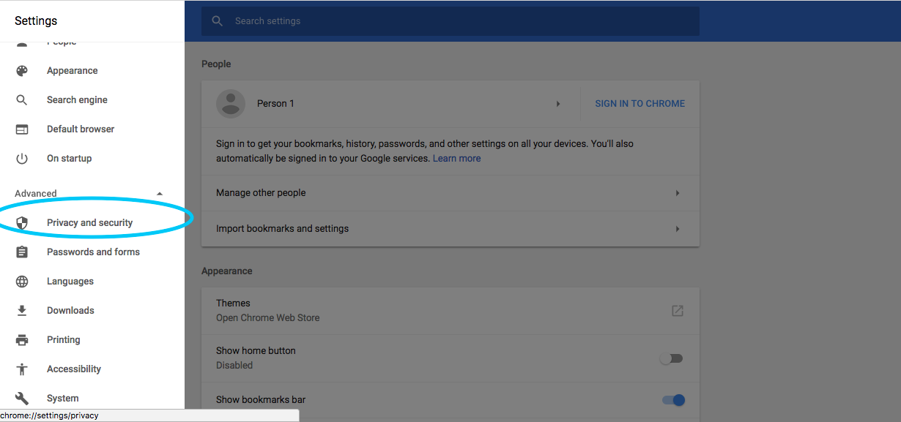

In this walkthrough, we will be looking at how a servers use certificates to validate their identity.

## Setup

For this walkthrough, we will be using the Spring Security to attach a certificate to a server.  

Check out the [Server Certificate Repo]() from Gitlab.  The project in the [Server Certificate Repo]() contains a simple project that contains the following:

1. `UserController` that checks the certificate of the user

2.  A properties file that contains defines to the `jks`, the `truststore`, and other configuration for SSL.

3.  A Makefile that simplifies the process of creating certificates.

### Certificate Setup

After checking out the example project, you will neeed to generate the cryptographic components required for Spring Boot to host a certificate.

A `jks` also known as a `Java Key Store` will need to be generated.  Since we will be using a self-signed certificate, this `jks` file will act as our local Certificate Authority.  Run the following command (be sure to use a secure password!):

```
$ make create-keystore PASSWORD=changeit
$ # Generate a certificate authority (CA)
keytool -genkey -alias ca -ext BC=ca:true \
	    -keyalg RSA -keysize 4096 -sigalg SHA512withRSA -keypass changeit \
	    -validity 3650 -dname 'CN=LaunchCode CA,OU=launchcode.org,O=LaunchCode,L=Saint Louis,ST=Missouri,C=CC' \
	    -keystore keystore.jks -storepass changeit
```

By doing an `ls`, you should now see that you `keystore.jks` file in your directory.

Next you will create a certificate for you local development environment. Run the following command:
```
$ make add-host HOSTNAME=localhost
```

Running `ls` will show that there are now two additional files in your director: `localhost.csr` and `localhost.cst`.

Next, you will need to create a `truststore`.  The `truststore` is where all trusted certificates are located.  It is essentially the `known_hosts` for certificates.

```
$ make create-truststore PASSWORD=verysecurepassword
# Export certificate authority
keytool -export -alias ca -file ca.crt -rfc \
	    -keystore keystore.jks -storepass verysecurepassword
Certificate stored in file <ca.crt>
# Import certificate authority into a new truststore
keytool -import -trustcacerts -noprompt -alias ca -file ca.crt \
	    -keystore truststore.jks -storepass verysecurepassword
Certificate was added to keystore
```

Running `ls` will show that two more files have been added to your directory: `ca.crt` and `truststore.jks`.

Next, you will add the certificate that you generated to the `truststore.jks` so that your user can access the the site.

```
$ make add-client CLIENTNAME=cid
keytool -genkey -alias cid \
	    -keyalg RSA -keysize 4096 -sigalg SHA512withRSA -keypass verysecurepassword \
	    -validity 3650 -dname 'CN=cid,OU=launchcode.com,O=LaunchCode,L=Saint Louis,ST=Missouri,C=CC' \
	    -keystore truststore.jks -storepass verysecurepassword
# Generate a host certificate signing request
keytool -certreq -alias cid -ext BC=ca:true \
	    -keyalg RSA -keysize 4096 -sigalg SHA512withRSA \
	    -validity 3650 -file "cid.csr" \
	    -keystore truststore.jks -storepass verysecurepassword
# Generate signed certificate with the certificate authority
keytool -gencert -alias ca \
	    -validity 3650 -sigalg SHA512withRSA \
	    -infile "cid.csr" -outfile "cid.crt" -rfc \
	    -keystore keystore.jks -storepass verysecurepassword
# Import signed certificate into the truststore
keytool -import -trustcacerts -alias cid \
	    -file "cid.crt" \
	    -keystore truststore.jks -storepass verysecurepassword
Certificate reply was installed in keystore
# Export private certificate for importing into a browser
keytool -importkeystore -srcalias cid \
	    -srckeystore truststore.jks -srcstorepass verysecurepassword \
	    -destkeystore "cid.p12" -deststorepass verysecurepassword \
	    -deststoretype PKCS12
```

A lot just happened, let's review.

* First, it needs to create a key for your user. A key is created and plaed in the `keystore.jks`. 

* Second, a signing requrest `.csr` file was generated based on the key.  This is what is used to aske the Certificate Authority to sign your certificate.
 
* Third, the signing requrest `.csr` is passed to the Certificate Authority and a signed certificate is passed back as the `cid.crt`.

* Fourth, the `cid.crt` file is stored in the `truststore.jks`.  

* Fifth and finally, the `cid.crt` file needs to be exported so that it can be included in the browser.  The result is a `cid.p12` file that can be given to the user and used to authenticate against an X509 server. 

### Authorization

Now that everything has been setup in on the server side, let's run the app and try to get access.  

Before you click run on your application, make sure that the `application.properties` is configured to point to the `keystore.jks` and the `truststore.jks`.  You will need to add the password for both the `keystore.jks` and the `truststore.jks` in order for the Java app to access those files.

Upon running the app, navigate to https://localhost:8443.  Notice that the app is now running on `https`.  This says that all traffic going over the write is encrypted.  The only question is "Do you trust the person that you are talking to?". 

The first thing you will notice is that your browser doesn't recognize the certificate from the server. Anytime there is a bad certificate on a server, your browser will freak out.  Let's fix that.


Open the Settings tab on Chrome (or the browser of your choie).


Under Advanced Settings, you will find the link to the `Privacy and security` page.


Finally, you should find the `Manage certificates` link on the page to be able to configure the certificates your browser trusts.


By clicking on `Certificates` in the bottom left hand corner of the screen, you should be able to see all of the certificates your browser supports.  They may be spread across several keychains. Be sure that you do not have any certificates selected otherwise the "+" button will not be enabled.


Click the "+" button and add the `localhost.crt` certificate that you had generated earlier in the walkthrough.

### Adding client-side certificates for Authorization

Open the Keychain Access program again and click on `MyCertificates`.  These are the client-side certificates that are currently installed on your compuster and that can be used to access a remote server.  Let's add a new certificate by clicking `File > Import Items...`.  Import the `cid.p12` file that you created earlier in the studio. 


After adding the client-side cert your browser will ask you to select a certificate and it works!
