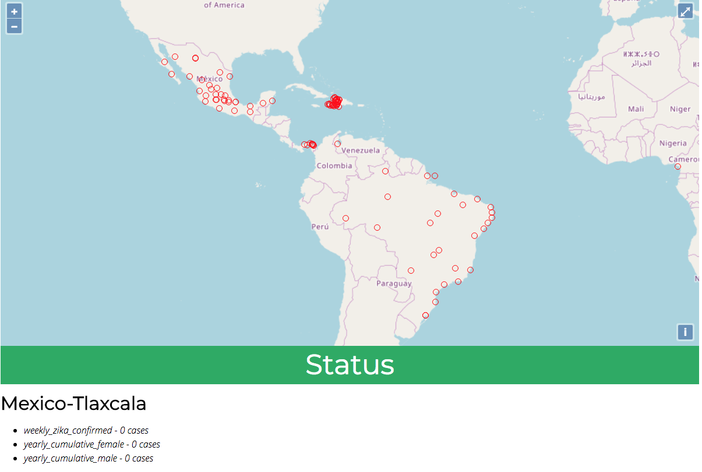

[Learning objectives for this week](../../objectives/#week2)

## Project

- [Mission Briefing 1](../../materials/week02/Zika_Mission_Briefing--Mission1.pdf)

## Overview

Your goal is to build a web application to help CDC scientists visualize the reports of Zika infection in Central and South America.  Using the concepts that you have learned from the past week, build a web application using Spring Boot that serves data to an OpenLayers map (starter code is provided below).  Be sure that your web application is properly tested so that you can easily modify the application during the future weeks.

Here are the user stories for your application.
1.  Scientists need to be able to populate the database with Zika reports that are in a CSV format.
2.  Scientists need to be able to see geographically where these infections are occurring so that they can respond with the appropriate assistance.
3.  Since each country reports data slightly differently, scientists need to be able to drill down into the data to understand what each report is saying.

## Requirements

Here is a mockup of the application you will be building.  

 - The database should be populated with Zika report data from Brazil, Mexico, Panama, and Haiti.
 - The app should show a red circle for each location that has provided a Zika report.
 - Upon clicking on a red dot, the location's name and any reported data show up below the status bar. Remember, each location may report multiple statistics and every country does not report the same statistics. 

## Project Hints

- Postgres allows you to import CSV files directly into the database if the columns on your CSV match the columns of in your target database table. Make sure that you have the full path to the file in the copy command.
```COPY report(field1, field2, field3, field4) from '/this/is/the/full/path/to/the/file' DELIMITER ',' CSV HEADER;```
- Every time Spring Boot starts up, it will run an `import.sql` file located in `src/main/resources`.  If you are importing data directly into the database via CSV, this is a convenient way to populate your database.
- Remember, Spring Boot is set to recreate your database every time it starts up.

## Setup
1. Setup Postgres - you will need to create two databases `zika` and `zika_test`.  Make sure that you install all of the geospatial extensions on Postgres.
```
$ createdb zika
$ createdb zika_test
$ psql -U (your mac username) zika
CREATE EXTENSION postgis;
CREATE EXTENSION postgis_topology;
CREATE EXTENSION fuzzystrmatch;
CREATE EXTENSION postgis_tiger_geocoder;
\c zika_test
CREATE EXTENSION postgis;
CREATE EXTENSION postgis_topology;
CREATE EXTENSION fuzzystrmatch;
CREATE EXTENSION postgis_tiger_geocoder;
```
2. Clone the [Zika CDC Dashboard](https://gitlab.com/LaunchCodeTraining/zika-cdc-dashboard)


## Turning In Your Work

 Your goal is to have your project done by Friday morning.
 - Commit and push your work to GitLab.
 - Notify the instructor when you are done. 

## Bonus Missions

If you complete the assignment with time to spare, improve your app by providing context about the size of the Zika outbreak.  Use this [OpenLayers tutorial](https://openlayers.org/en/latest/examples/kml-earthquakes.html) as a guide to change the size and color of the feature based on number of cases.

## Resources
- [CSS Selectors](https://www.w3schools.com/cssref/css_selectors.asp)
- [JSON Lint](https://jsonlint.com/)
- [geojson.io](http://geojson.io/#map=2/20.0/0.0)
<aside class="aside-note" markdown="1">
Remember that both jQuery and OpenLayers will silently fail if they are not given valid JSON and valid GeoJSON (respectively).  Be sure to lint your services before attempting to hook them up to the front end.
</aside>
