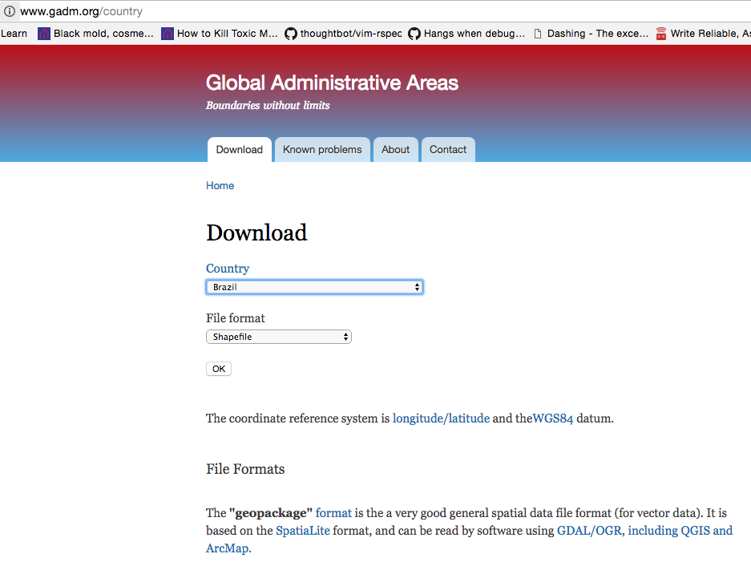
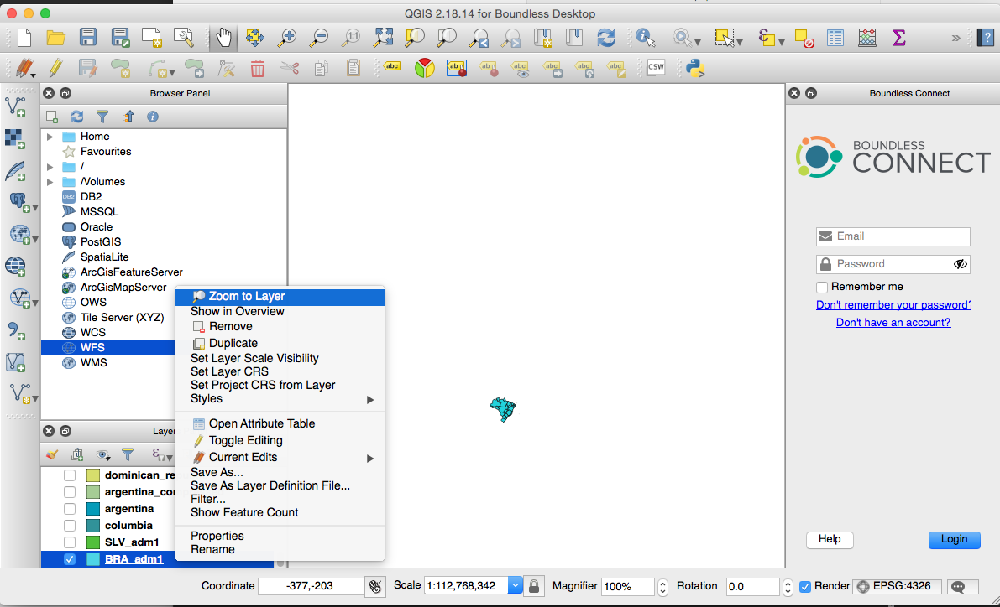
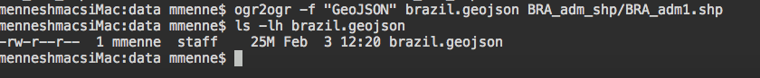
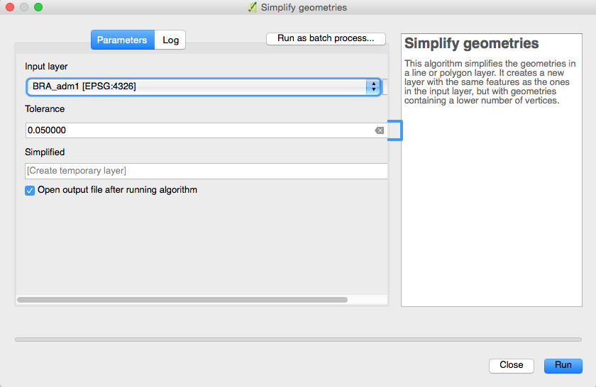
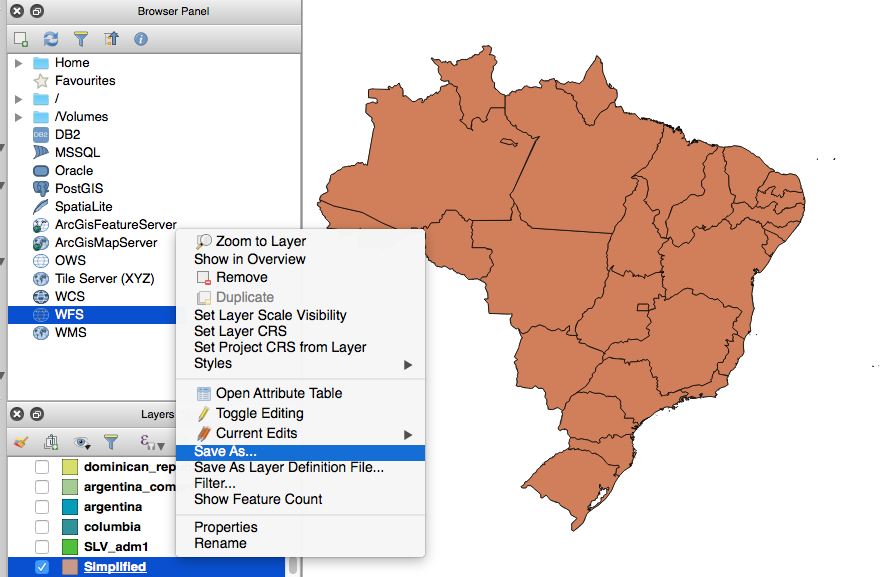
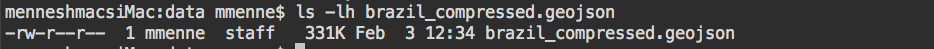

## Project

[Mission Briefing 2](../../materials/week04/zika_mission_briefing-mission_2.pdf)

## Overview

Your goal is to extend the CDC Zika Dashboard that you built last week. The scientists need several new features for the dashboard. Here are the stories:

1. CDC scientists have the ability to add new reports to the database.
2. CDC scientists have the  ability to visualize how the infection rate of each area changes over time.
3. CDC scientists have the ability to perform fuzzy search across all of the data.

<aside class="aside-note" markdown="1">
Remember, in Agile a story is just a "guaranteed conversation". Stories usually don't contain all of the details necessary to complete the task and that's why it is important to follow up with the client and talk through the exact needs of your customer.
</aside>

## Getting the code
1. Create a feature branch named `week4-solution` from your solution to the week 2 zika project
2. Make sure you have a remote in your repo that points to https://gitlab.com/LaunchCodeTraining/zika-cdc-dashboard
3. Run `git fetch upstream` (Assuming upstream points to the above repo)
4. Run `git checkout -b week4-starter upstream/week4-starter`
5. Run `git checkout week4-soltuion`
6. Now you can get the new files by pulling them in. Run `git merge week4-starter` OR by simply pasting in select files. The choice is up to you.

<aside class="aside-note" markdown="1">
If you decide to back out of a merge and try something else you can always reset your branch to it's previous state. 
The below command destroys all non committed changes in your local branch and reverts back to the previous commit.
```nohighlight
$ git reset --hard
```
</aside>

## What's new in the code
* CSV files `data/locations.csv` and `data/all_reports.csv`
* `src/main/resources/data.sql` copies the csv data into Postgis when SpringBoot is ran
* Location data now contains multi-polygons instead of a single point
* ElasticSearch dependencies and Repositories have been added
* `ESController` contains an endpoint to populate ElasticSearch with all data in your Postgis db

## Requirements
Use TDD when implementing these requirements
1. Build out a `/api/report` endpoint that accepts a POST containing Report JSON in the body.
* Store the Report created from JSON in PostGis
* Store the ReportDocument created from JSON in ElasticSearch
2. Show Zika report data for a certain date on a map via OpenLayers (reports grouped by state for a certain date)
3. When a feature is clicked show the related report data (like in week 2 zika project)
4. Ability to change the data displayed by changing the report date 
5. Search input and search button that uses ElasticSearch fuzzy search
* When search is executed matching reports should be shown below map
* And/Or Features present on map should change to be only those that match report date and fuzzy search term
6. Make sure you application is secure from [sql injection attacks](https://www.owasp.org/index.php/SQL_Injection) by validating the query parameters
7. Create API docs with springfox and swagger
8. Use Eslint and Airbnb ruleset to make sure your JS meets team standards

## Suggested Endpoints/Parameters
1. `api/report?date=2016-05-14` should return GeoJSON created from reports filtered by report date
* Most likey you want this data to come from ElasticSearch because of requirement #2
2. `api/report?search=brzil` should return GeoJSON created from ElasticSearch filtered using fuzzy search
3. `api/report?search=brzil&date=2016-05-14` should use both the `date` and `search` query parameters to limit the results3. 
4. `api/report/unique-dates` returns json containing all unique report dates

<aside class="aside-note" markdown="1">
To index all of the reports in Postgis into ElasticSearch use the following command:
```nohighlight
$ curl -XPOST http://localhost:8080/api/_cluster/reindex
```
</aside>

## Database Setup

Install the following extension on your Postgis databases (don't forget your test db):

```nohighlight
# CREATE EXTENSION unaccent;
```

## Bonus Missions
- No bonsuses. Do as much as you can this week. We will build on this project in all upcoming project weeks.

## Walkthrough on Creating the Location Data

All the spatial data you need is already included in the starter branch. However before starting to code this project please go through this walkthrough to see how it was created.  This will provide some insight into creating and configuring spatial data such as country and state boundaries.

### Adding Boundary Geometries

The data that the scientists want to ingest is summarized in the [CDC Zika Repository](https://github.com/cdcepi/zika). If you open up the [data for Argentina](https://github.com/cdcepi/zika/blob/master/Argentina/Surveillance_Bulletin/data/Surveillance_Bulletin_01_2017-01-12.csv), you'll notice that the data looks pretty similiar to last mission, except that there is no latitude or longitude to GeoCode each row; however, each row does have a location field. We should be able to indentify those locations to actual data points on a map.

You Google for "political boundaries geojson" and you find [gadm.org](http://www.gadm.org/). [gadm.org](http://www.gadm.org/country) serves up geospatial data about administrative boundaries for each state. Go to the [GADM Downloads Page](http://www.gadm.org/country) to check out the data.

</img>

[Download the shapefile for Brazil](http://biogeo.ucdavis.edu/data/gadm2.8/shp/BRA_adm_shp.zip).

The file `BRA_adm_shp.zip` will download. Double click the file to unzip the file. You should see three shapefiles: `BRA_adm0.shp`, `BRA_adm1.shp`, `BRA_adm2.shp`. `BRA_adm3.shp`. Let's take a look at these shapefiles. In order to look at a shapefile, you will need download [QGIS](https://qgis.org/en/site/), an open source desktop viewer for geospatial data. [Click Here to Download QGIS](https://connect.boundlessgeo.com/Downloads). Double click the `.dmg` file to install.

<aside class="aside-note" markdown="1">
Note: Use your personal email to register on Boundless Connect to get access to the QGIS download.
</aside>

After QGIS is installed, drag the `BRA_adm1.shp` file into the QGIS window in order to import the file.

<aside class="aside-note" markdown="1">
The zoom on the QGIS window is VERY sensitive. You may need to automatically zoom to the layer you would like to view. Right click on your layer in the `Layers Panel`, and select `Zoom to Layer`.
</img>
</aside>

Great! That looks exactly like what we need. Let's convert the file into GeoJSON so that we can serve it up from within our web application. We can use the `ogr2ogr` command.

```nohighlight
$ ogr2ogr -f "GeoJSON" brazil.geojson BRA_adm_shp/BRA_adm1.shp
```

After the command completes, check out the `brazil.geojson` file. Yikes! The file seems pretty big. Let's see how big:

```nohighlight
$ ls -lh brazil.geojson
```

</img>

A 25M file is not going to work well in our web app. And that's just Brazil!

Fortunately, shapefiles can be compressed in size by reducing the amount of detail. In QGIS, select `Vector > Geometry Tools > Simplify geometries` from the top menu. Select your Brazil Geometry `BRA_adm1` and set the tolerance to `0.05`. Hit Run.

</img>

QGIS should generate a new layer that looks pretty much the same as the last layer.

Right click on the newly created layer and select *Save As...*. Save the file as GeoJSON with the name `brazil_compressed.geojson`. Be sure to type in the entire path of the file that you are creating.

</img>
Now if you check the size of the newly created `brazil_compressed.geojson`, you should see that it is much smaller!

Run the command:

```nohighlight
$ ls -lh brazil_compressed.geojson
```

</img>

<aside class="aside-note" markdown="1">
A file size of 331K isn't great for a webapp; it's still a bit large. In a few weeks, we'll look at how some of the features of GeoServer allows you to display large amounts of data without a big download.
</aside>

The last step is to join all of the GeoJSON files together. To do that, we can use a nice Node.js library from MapBox. Run the following commands:

```nohighlight
$ npm install -g @mapbox/geojson-merge
$ geojson-merge argentina_compressed.geojson brazil_compressed.geojson columbia_compressed.geojson dominican_republic_compressed.geojson el_salvador_compressed.geojson equador_compressed.geojson guatamala_compressed.geojson haiti_compressed.geojson mexico_compressed.geojson
nicaragua_compressed.geojson panama_compressed.geojson > states.geojson
```

To save you time, we went ahead and optimized the geometries for each country. Some might still need some work, but can 
tackle that some day when you are bored.
