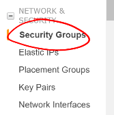

# Dev Ops Basics

## Project

## Overview

Your goal is to deploy a Spring Boot project to a remote server and verify its execution. This will establish the basics for working in a cloud environment.

## Set Up Project

- Build the Airwaze Studio project
- Make sure the jar is built in `build/libs`

## Start an Instance on AWS

1. Go to the EC2 Dashboard:
    - Click on `Services` in the page header
    - Locate and click on `EC2` under **Compute**


2. On the EC2 Dashboard
    - Locate and click the `Instances` link in the sidebar


3. On the Instances screen
    - Locate and click the `Launch Instance` button at the top of the page


### Starting an AWS Instance

When creating a new instance, Amazon provides multiple free **Amazon Machine Images** (AMIs) to choose from. This is a pre-configured operating system installation with multiple tools ready for use. For this exercise, we want to use the **Ubuntu Server 16.04 LTS** AMI. Locate it in the list of "Quick Start" images and click its `Select` button.


Next, the console will ask which type of instance to set up. Your choice here defines the amount of virtual CPU cores, RAM, and network perforance you want. This also directly affects the cost of the running instance. Select the `t2.micro` service, then click "Configure Instance Details".


The following screen allows for configuration of instance. We do not need to customize this image beyond the defaults, so you can continue to "Add Storage".

On this screen, you can choose what storage is available to your instance. AWS will provision a virtual volumes in Elastic Block Store to serve as the valume(s) mounted in your instance. By default, it will create an 8 GiB volume to serve as the instance's root volume. The default 8 GiB volume is sufficient for this application. Click on "Add Tags" to progress to the next step.


The "Add Tags" screen is useful for larger enterprise environments, for instance, where ownership and internal billing of instances can be broken down by tags. For this exercise, we do not need any tags, so progress to "Configure Security Group".


Configuring the security groups for your server is critical for protecting your instance from unauthorized remote access. You are liable for the work and costs generated by your instance. An openly-accessible instance can risk your infrastructure security and total costs if it were to be compromised.
  - Create a new security group for your instance with a unique name
  - Add a useful description for the security group so you know its purpose in the future
  - Change the existing rule's source to "My IP"
    - This allows remote SSH access to your instance, but only from the IP you're currently using to access AWS
  - Continue to "Review and Launch"


This screen gives you a final chance to review and change the settings you chose for this instance. Open the dropdowns on the screen and when you're ready, click "Launch".

This will open a popup on the screen that allows you to configure a key pair for the instance. This will generate the key necessary to SSH into the instance and without this you will not be able to access your instance. In an enterprise environment, there will likely already be multiple key pairs set up that you would use here. For the purpose of this project, create a new key pair:
  - Select "Create a new key pair" in the first select box
  - Give your key pair a good name, possibly the same name you gave your security group
  - Click "Download Key Pair"
  - Store this `*.pem` file in a good location and do not lose it
  - Click "Launch Instances"

AWS will now begin launching your instance. You can click the identifier for your instance to monitor it as it starts up. This will take you back to the Instances dashboard. Take note of your instance's public DNS and IP; you will need this in order to SSH into your instance later.


## Set up SSH

- Open the terminal. (On Mac, it is an app under Utilities named Terminal.)
- Navigate to your user's ssh configuration folder:
```
$ cd ~/.ssh
```
- Copy your instance's *.pem file to your .ssh folder:
```
$ cp /path/to/*.pem .
```
- Change the permissions for this file to read-only by your user:
```
$ chmod 400 name-of-pem.pem
```
- Using the Public DNS you noted before and your *.pem file, access your AWS instance:
```
$ ssh -i ~/.ssh/name-of-pem.pem ubuntu@ec2-public-dns.us-east-2.compute.amazonaws.com
```
- The ssh program will likely warn that the authenticity of your host can't be established since it's not seen it before. Respond "yes" to continue connecting. It will add it to the list of known hosts and continue the connection process.
- The remote terminal will appear


Congratulations! You have successfully created and connected to an instance running in the cloud.

## Running Your Application In the Cloud

Now that you have a server running in the cloud, you need to use it to do some work. Let's prepare the server to run our application.

First, uou don't want the application running under your system account, so we need to create a new user with a password:
```
$ sudo adduser airwaze
```
Next, upload the Airwaze Studio jar to the server. We'll use scp to securely transmit the file to our server.
```
$ scp -i ~/.ssh/name-of-pem.pem /path/to/local/app.jar ubuntu@ec2-public-dns.us-east-2.compute.amazonaws.com:/home/ubuntu/app.jar
```
Then we'll log into the server, move the file to the airwaze home directory, and make it owned and executable by that user.
```
$ ssh -i ~/.ssh/name-of-pem.pem ubuntu@ec2-public-dns.us-east-2.compute.amazonaws.com

# Then, on AWS
$ sudo apt-get install openjdk-8-jdk
$ sudo mv ~/app.jar /home/airwaze/app.jar
$ sudo chown airwaze:airwaze /home/airwaze/app.jar
$ sudo chmod 500 /home/airwaze/app.jar
```

Before trying to start the application, we'll install `postgres` locally so we can start Airwaze Studio. **This is something you would *never* do in a real cloud instance**, but we'll do it just for this demonstration so our app will start.
```
$ sudo apt-get update
$ sudo apt-get install postgresql postgresql-contrib postgis
$ sudo -u postgres createuser --pwprompt airwaze_app_user # give password `mysecretpassword`
$ sudo -u postgres createdb -O airwaze_app_user airwaze
$ sudo vim /etc/postgresql/9.5/main/pg_hba.conf  # change all `peer` and `md5` to `trust` - also a general no-no!
$ sudo /etc/init.d/postgresql restart
$ sudo -u postgresl psql
CREATE EXTENSION postgis;
CREATE EXTENSION postgis_topology;
CREATE EXTENSION fuzzystrmatch;
CREATE EXTENSION postgis_tiger_geocoder;
```

Now that the app is on the cloud server and the database is ready, we can set up `systemd` to run this app as a service.

In order to use `systemd`, we have to make a script in `/etc/systemd/system` to tell the service how to run our app.
```
$ sudo vim /etc/systemd/system/airwaze.service
```
Press `i` to start inserting text into the file and paste the following:
```
[Unit]
Description=Airwaze Studio
After=syslog.target

[Service]
User=airwaze
ExecStart=/home/airwaze/app.jar SuccessExitStatus=143
Restart=always

[Install]
WantedBy=multi-user.target
```
Once this service definition is in place, set the service to starts automatically on boot with systemd using the `systemctl` utility and also start now:
```
$ sudo systemctl enable airwaze
$ sudo systemctl start airwaze
```
And you can view the logs for the service with `journalctl`.
```
$ journalctl -f -u airwaze.service
```

Now that your application is running, open up a new port in our Security Group from before to allow for web communications.
- Return to the AWS web console
- Click `Security Groups` in the sidebar


- Select the security group with the name you used before


- Click the `Inbound` tab and `Edit` the inbound traffic list


- Add a new `Custom TCP` rule for port 8080 and select `My IP` for the source


- Click `Save`
This opens up a new port in the Security Group just for your IP. The Airwaze app is set up to listen to port 8080 and communicating with that port from your browser will allow you to communicate with the application.
- Open your browser
- Go to your server on port 8080:
  - http://ec2-public-dns.us-east-2.compute.amazonaws.com:8080


If you kept `journalctl` running from before, you should see the logs progress as your browser communicates with the app.

Congratulations! You now have your own application in the cloud!

## Bonus Missions
