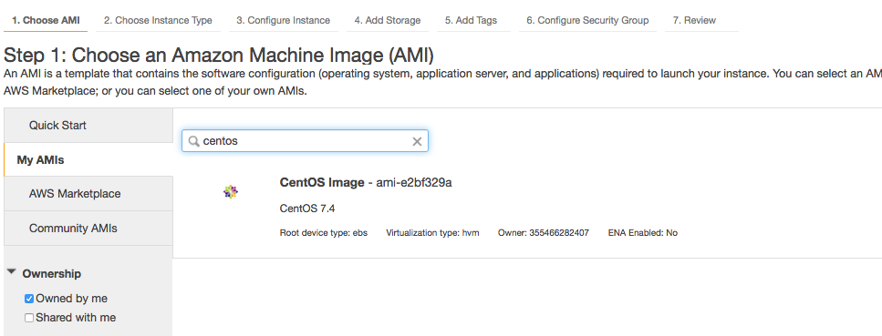

## Project

[Mission Briefing 3](../../materials/week06/zika_mission_briefing_3.pdf)

## Overview

The Zika Dashboard that your team has built is growing in popularity. In fact, the application is strained under increased load from CDC Scientists. Your team needs to find a way for you app to scale under increased load. The goals of this mission are as follows:

1. Deploy your application remotely using Amazon Web Services.
2. Configure a Jenkins job to automatically build and test your code. Jenkins should save an executable JAR file to S3 if all of the relevant checkes pass.

## Requirements

To complete this project, your app should meet the following requirements:

* Your application is deployed via AWS at a live URL
* You use CentOS for your EC2 instances (details below)
* Setup a LaunchConfiguration to spin up new Web App EC2 instances
* You setup a VPC for your Web app, RDS, and ElasticSearch
* ElasticSearch is hosted on an EC2 inside your VPC
* Your application can consistently handle 300 requests per second
* Jenkins watches your repo pushes a release to S3 if all of the following pass:
  * All tests pass
* ESLint has no warnings

## New Stuff
There will be a few differences in this project compared to previous week's studios/project.  You may just want to copy over certain changes instead of merging [Week 6 Starter](https://gitlab.com/LaunchCodeTraining/zika-cdc-dashboard/tree/week6-starter). NOTE that the starter branch only contains config, property, and aws scripts. The starter branch does not contain a solution for week 4.

Review the changes by looking at this branch comparison: [week4 compared to week6](https://gitlab.com/LaunchCodeTraining/zika-cdc-dashboard/compare/week4-starter...week6-starter)

### Specific Changes
1. You will be using the `CentOS` operating system instead of `Ubuntu`
2. Using Spring Data 2.0.2 (dependencies have been updated in build.gradle)
3. When running locally you will be running ElasticSearch inside a docker instance (details below)
4. When running in the cloaud you will be running ElasticSearch on an EC2 instance


## Setup Locally
To run Elasticsearch locally, we are going to be using Docker, here is the command:
- Download docker installer from [here](https://store.docker.com/editions/community/docker-ce-desktop-mac)
- That will install docker as a service and an application that will run everytime your computer starts. (look for the whale icon in your menu bar at the top of your mac)
- Now you can run `$ docker` commands in your terminal. Like the one below. (this runs a docker instance that contains ElasticSearch)
- The connection information for the docker version of ElasticSearch is contained in the comments of [this file](https://gitlab.com/LaunchCodeTraining/zika-cdc-dashboard/blob/week6-starter/src/main/resources/application.properties) 
- MAKE SURE YOUR TESTS ARE PASSING LOCALLY BEFORE MOVING TO THE CLOUD
<aside class="aside-note" markdown="1">
Be sure to stop your home brew Elasticsearch by running `brew services stop elasticsearch`
</aside>
```nohighlight
$ docker run -p 9200:9200 -p 9300:9300 -e "discovery.type=single-node"  -e "xpack.security.enabled=false" docker.elastic.co/elasticsearch/elasticsearch:5.6.0
```

## Setup in the Cloud

### CentOS
`CentOS` is a free, enterprise class, Linux distribution based on Red Hat Enterprise Linux. Most of the commands will be the same as Ubuntu, except the package manager will use `yum install` instead of `apt-get install`. CentOS comes with less software installed than Ubuntu. For example `telnet` has to be installed via `sudo yum install telnet` [Info on Image of CentOS we will use](https://wiki.centos.org/Cloud/AWS)

<aside class="aside-note" markdown="1">
To log into a CentOS instance, you will need to use the username `centos`.
</aside>

How to manually create an AWS EC2 instance using CentOS
* Go to Oregon Region
* Click **Launch Instance** on the EC2 Dashboard
* Click **My AMIs**
* Search for **centos**
* Click **CentOS Image** 



### Cloud ElasticSearch
In the clouid you will be running ElasticSearch on it's own EC2 instance.

* You'll need to spin up a `t2.small` EC2 instance to serve ElasticSearch.

* Use the [`startup_elasticsearch.sh` script](https://gitlab.com/LaunchCodeTraining/zika-cdc-dashboard/blob/week6-starter/cloud/elastic_userdata.sh) in the week6-starter project to configure a `t2.small` machine.
* If you get an "Out of Memory Exception", be sure to increase the heap size by setting `Xms3g` and `Xmx4g` in the `/etc/elasticsearch/jvm.options` file.

### Create and Populate the RDS
You will need to spin up an "YourName-AdminMachine" to configure your RDS. You will likely use this same machine to populate your ElasticSearch instance.

1. Create CentOS EC2 named "YourName-ZikaAdminMachine"
2. Install Postgresql
3. Copy over .csv files to the server
4. Create the db tables
* By starting the web app
* Or running an sql script with create table statements
5. Run psql COPY commands to populate the tables

### Seed the ElasticSearch Data Store
When you ElasticSearch instance starts it has not data. We need to insert all reports in Postgresl into ElasticSearch.

1. Make a `POST` reuqest to `/api/_cluster/reindex` on "YourName-AdminMachine" EC2
2. This instance can be spun down after your RDS and ElasticSearch is working
<aside class="aside-note" markdown="1">
The "YourName-AdminMachine" instance may need to be a `t2.small` or `t2.medium` in order to handle the POST request that transfers all the reports to ElasticSearch. You will know this is the case if you see "out of memory" exceptions.
</aside>


### VPC Setup
To get started, you are provided with a CloudFormation template in an S3 bucket. This CloudFormation template provisions a VPC with the following:

1. Two public subnets with an internet gateway (each in their own availability zone).
2. Two private subnets (each in their own availability zone).
3. One security group for web servers (ports 80 and 22 open). `WebAppSecurityGroup`
4. One security group for databases (port 5432 open). `DatabaseSecurityGroup`
5. One security group for load balancers (port 80 open). `ELBSecurityGroup`

The setup CloudFormation script can be found at:

https://s3.amazonaws.com/launchcode-gisdevops-cloudformation/zika_cloudformation.json

Follow the instruction from the [Scaling AWS Studio](https://education.launchcode.org/gis-devops/studios/AWS3#configure-your-vpc) to setup your VPC from a CloudFormation script.
