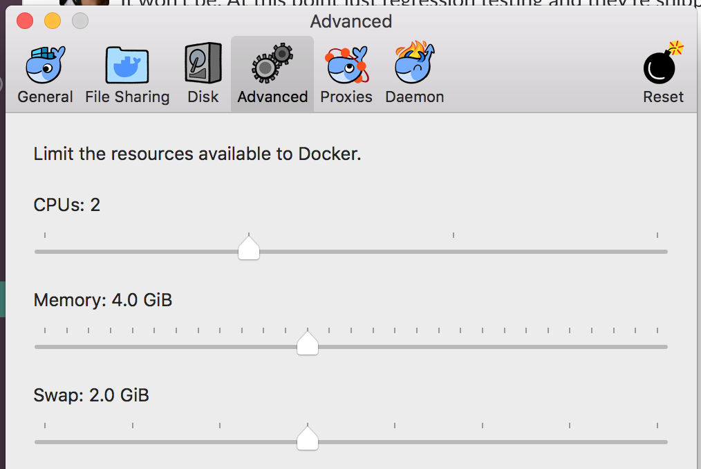

## Overview

Read [Mission Briefing 4](../../materials/week08/zika_mission_briefing_4.pdf).

You will be adding GeoServer to your local and deployed application. This will require several steps, including setting up a GeoServer instance, connecting it to a PostGIS store, and creating a new layer from existing data.

After you have this new system fully set up, you'll be able to add additional layers in GeoServer and show them using OpenLayers.

## Requirements
1. Use GeoServer to display the report features
2. You have incorporated additional layers using external data (examples: elevation, temperature, natural earth)
3. You have deployed your application to AWS, including a EC2 instance running GeoServer

## New Stuff
There are a few differences in this project compared to week6-starter.  You may want to copy over certain changes instead of merging. - - [Week 8 Starter](https://gitlab.com/LaunchCodeTraining/zika-cdc-dashboard/tree/week8-starter)
- [Week8-starer compared to Week6-starter](https://gitlab.com/LaunchCodeTraining/zika-cdc-dashboard/compare/week6-starter...week8-starter)

### Specific Changes
- Using three docker containers locally
  1. GeoServer container
  2. Postgis container
  3. ElasticSearch container
- Partially normalized repot data
 - Relationship between `Report` and `Location` via `Report.state`
 - Setup by hibernate relationship
 - Populated by `POST`ing to endpoint `/report/assignStates`
- `cloud/geoserver_userdata.sh` is provided to create a GeoServer instance in AWS 
- Running Tomcat on a different port locally by adding `server.port={SERVER_PORT}` to `application.properties`
 - Then set env variable `SERVER_PORT=9090`

## Setup Locally

Before getting started, be sure you **DON'T** have your Boundless virtual machine running. We'll be using the same ports as the VM, so if it is running there will be conflicts. It is not enough to pause the VM; you must shut it down completely or select *Save State*.

### Docker Commands
- `docker ps` see list of **running** containers
- `docker ps -a` see lisf of all containers, including ones that failed or were stopped
- `docker start <container-name or id>` starts the container
- `docker stop <container-name or id>` stops the container
- `docker restart <container-name or id>` restarts the container
- `docker rm <container-name or id>` removes the container
- `docker images` shows list of images that you have downloaded. containers are created from images
- `docker image rm <image-name or id>` removes an image
- For more info and more commands please see [the Docker CLI docs](https://docs.docker.com/engine/reference/commandline/docker/)

<aside class="aside-warning" markdown="1">
If your containers start crashing with exit code 137, it's because they are out of memory. You need to incrase the memory given to Docker by going to Peferences, Advanced. See screen shot below.
</aside>



### Create Postgis Container
First create a file `env.list` in the root of your `zika-cdc-dashboard` project folder, with the same contents as [our `envlist` file](https://gist.github.com/chrisbay/d74442a8e8707111472a742832d76796).

Next run this command to create a postgis container referencing `env.list` from above.  We have to use a docker instance of Postgis so that our GeoServer docker instance and our local web application can both connect to Postgis.
```nohighlight
$ docker run --name "postgis" -p 5432:5432 -d -t --env-file ./env.list kartoza/postgis:9.4-2.1
```

<aside class="aside-warning" markdown="1">
In `env.list` you'll see that the `POSTGRES_DBNAME` environment variable is set to `zika`. This variable is supposed to set the name of our PostGIS-enabled database within the container to be `zika`. However, a bug in the Dockerfile for this image ignores the name, creating a database named `gis`.
</aside>

Verify that the container is running by running `docker ps`

### Create GeoServer Container
We are going to "link" the postgis and geoserver containers. That tells docker that these containers need to be able to communicate.
```nohighlight
$ docker run --name "geoserver" --link postgis:postgis -p 8080:8080 -d -t kartoza/geoserver
```

<aside class="aside-warning" markdown="1">
If the `postgis` docker image is not running when starting the geoserver, the link will fail.
</aside>

When it's container is running, you can access this GeoServer instance the same way in which you previously accessed GeoServer locally when running the Boundless virtual machine. It will be running on port 8080 (try http://localhost:8080/geoserver) with credientials **admin / geoserver**.


### Create ElasticSearch Container


```nohighlight
$ docker run --name "es" -p 9200:9200 -p 9300:9300 -e "discovery.type=single-node"  -e "xpack.security.enabled=false" docker.elastic.co/elasticsearch/elasticsearch:5.6.0
```

<aside class="aside-warning" markdown="1">
If Docker has no more than 2G of memory allocated for container use, you may have issues with the `elasticsearch` container crashing due to lack of memory. If this happens, increase memorgy to at least 3G by going to *Docker > Preferences > Advanced*.
</aside>

### Enable CORS in GeoServer

You may want to wait until you actually see a [CORS](https://developer.mozilla.org/en-US/docs/Web/HTTP/CORS) error in your browser's JavaScript console before performing these steps. A short summary is that the GeoServer web server needs to be configured to allow requests to come from a certain client.

You'll be making requests to the GeoServer container from a port other than the one on which GeoServer is running, which means CORS will come into play. Let's enable cross-origin requests within GeoServer.

Open a shell within the Docker container and install a text editor (you can also install `nano` instead of `vim` if you want):

```nohighlight
$ docker exec -it geoserver bash
root@2992f761f41e:/usr/local/tomcat# apt-get update
root@2992f761f41e:/usr/local/tomcat# apt-get install vim
```

Open the GeoServer `web.xml` for editing:

```nohighlight
root@2992f761f41e:# vi /usr/local/tomcat/conf/web.xml
```

Add the following XML just within the opening `<web-app>` tag:

```xml
<filter>
  <filter-name>CorsFilter</filter-name>
  <filter-class>org.apache.catalina.filters.CorsFilter</filter-class>
</filter>
<filter-mapping>
  <filter-name>CorsFilter</filter-name>
  <url-pattern>/*</url-pattern>
</filter-mapping>
```

Save the file and exit. Then exit the docker container shell.
```nohighlight
root@2992f761f41e:# exit
```

Stop and start the `geoserver` container:

```nohighlight
$ docker stop geoserver
$ docker start geoserver
```

Now `XHR`requests from your local zika app running on `http://localhost:9090` will be accepted by our GeoServer instance. If you don't set that up, you will see `CORS` errors in the js console.

### Populate Container PostGIS Database

We need to load the report and location data into the **postgis** docker container.  We will copy over the `.csv` files to the container and execute psql copy commands.

- First, let's change the paths referenced in the `/src/main/resources/data.sql` file to be `'/tmp/locations.csv'` and `'/tmp/all_reports.csv'`
- Then copy the files to the `postgis` contianer:

```nohighlight
$ docker cp locations.csv postgis:/tmp
$ docker cp all_reports.csv postgis:/tmp
```

Verify that the files made it:

```nohighlight
$ docker exec -it postgis ls -l /tmp
```

Remember that `data.sql` makes use of the `unaccent` function, which is part of the `unaccent` Postgres extension. While our Docker image came with the PostGIS extension installed, the `unaccent` extention is *not* present. Let's fix that.

Also `data.sql` will not actually be executed by spring data. If you rename it to `import.sql` and edit property `spring.jpa.hibernate.ddl-auto` in `application.properties`. If `spring.jpa.hibernate.ddl-auto` is either `create` or `create-drop`, then `import.sql` will run. After you database has been initialized you can change the value to `validate`. More here on [Spring Data - Database Initialization](https://docs.spring.io/spring-boot/docs/current/reference/html/howto-database-initialization.html)

<aside class="aside-warning" markdown="1">
Stop all instances of Postgres on your local machine. Stop the Postgress App in the top bar and stop the service being ran by brew. The only Postgres we want running is the one inside of docker. If you get an error below that the `gis` database doesn't exist, then you are connected to a different local Postgres.
</aside>

Fire up `psql`, note the password for zika_app_user is "somethingsensible":

```nohighlight
$ psql -h localhost -p 5432 -U zika_app_user -d gis
```

And then install the extension:

```nohighlight
# create extension unaccent;
```

Exit `psql`.

### Change Tomcat Port

Now, configure your `zika-cdc-dashboard` app so it can connect to the PostGIS datbase. This requires editing the environment variables in the `Application` run configuration. The only edit you should need to make is to set the `APP_DB_NAME` to `gis` (see the Warning above).

Before we can run our Spring app, we need to configure it to run on a port other than 8080. Recall that we set up the GeoServer container to bind to port 8080 on our localhost, so the default for Spring (which is also 8080) will not work. We can easily adjust the port that Spring will run on by adding `server.port=9090` to `application.properties`.

<aside class="aside-note" markdown="1">
You may also need to change the port referenced in `script.js`. `url: 'http://localhost:9090/api/es/report/?date=2016-03-05'`. Another solution for this is to use a relative path `url: '/api/es/report/?date=2016-03-05'`
</aside>


Start up your Spring app. Verify that the app started up cleanly, and that the `locations` and `reports` databases were built and populated properly.

<aside class="aside-pro-tip" markdown="1">
If your `locations` and `reports` databases aren't being populated, you can populat them manually by copying the `data.sql` file in `src/main/resources/` to the `postgis` container (see above) and running:

```nohighlight
$ docker exec -it postgis psql -h localhost -U zika_app_user -d gis -a -f /tmp/data.sql
```
</aside>

### Add foreigh keys to reports

We want to set up explicit relationships between reports and locations in the database. To do this, we've created an endpoint that for each `Report` object, will look for a corresponding `Location` object and create a reference/foreign key relationship.

Start up your Spring app and hit the endpoint from the command line:

```nohighlight
$ curl -XPOST http://localhost:9090/api/report/assignStates
```

This will take a few minutes to run. When the request is complete, all `Report` objects for which there is a corresponding `Location` will have the relationship stored as a foreign key in the `report.state_id` column.

### Database and Layer Setup

These views will allow us to create a layer in GeoServer that will allow us to query location geometries with case totals by date.

Using either `psql` or PSequel to connect to the containter PostGIS database (recall that it is accessible on port 5432 from your local environment). Create two views:

```sql
CREATE view cases_by_state_and_date AS 
  SELECT state_id,report_date,sum(value) AS cases FROM report 
  GROUP BY state_id,report_date;
```

```sql
CREATE view states_with_cases_by_date AS 
  SELECT * FROM location INNER JOIN cases_by_state_and_date ON location.id=cases_by_state_and_date.state_id;
```


### Create Data Store and Layers in GeoServer

- Create a workspace in GeoServer (we recommend `lc/https://launchcode.org`)
- Create a PostGIS data store 
  - Use `gis` as the database name and `postgis` as the hostname
- Create a new layer from the `states_with_cases_by_date` table
  - Make sure Native and Declared SRS are set to **EPSG:4326**
  - For Native Bounding Box, click on *Compute from data*
  - For Lat/Lon Bounding Box, click on *Compute from native bounds*

### Updating OpenLayers Code

Following the [OpenLayers example](https://openlayers.org/en/latest/examples/vector-wfs-getfeature.html) for querying `GetFeature`, update your OpenLayers code to query GeoServer to get locations with report totals by date. You'll need to use the `ol.format.filter.equalTo` filter.

<aside class="aside-warning" markdown="1">
For the geometries in your layer to be rendered properly on the map, the spatial reference systems (SRS) must match. You can control the SRS that is used to generate the returned features using the `srsName` parameter when create the request in OpenLayers.
</aside>

### Update Report POST Endpoint

There is a controller in `ReportController` called `saveNewReport` that saves creates a new report object and saves it in both data stores (Postgresql and Elasticsearch). Update this method so that it looks up and assigns the corresponding `Location` object (if one exists) for the given report.


## Setup in the Cloud

For deploying GeoServer on AWS you will be using a `t2.small` CentOS machine.

Paste the contents of shell script [geoserver_userdata.sh](https://gitlab.com/LaunchCodeTraining/zika-cdc-dashboard/blob/week8-starter/cloud/geoserver_userdata.sh) into the "Advanced Details" details section of "Configure Instance" to create the instace.  The script installs Apache Tomcat, downloads the Boundless Suite WAR, and deploys the geoserver WAR the Apache Tomcat server.  The deployed geoserver can be reached on `http://{your IP}:8080/geoserver`.

<aside class="aside-hint" markdown="1">
Remember the default username for Geoserver is `admin` and the default password is `Geoserver`.
</aside>

<h2 id="bonus-missions">Bonus Missions</h2>

When you complete all of these instructions, check out the [ElasticGeo Plugin](https://github.com/ngageoint/elasticgeo).  [ElasticGeo](https://github.com/ngageoint/elasticgeo) is an Elasticsearch plugin that allows you to integrate Elasticsearch into Geoserver.  The great thing is that that you can do Elasticsearch queries directly through Geoserver via WFS calls.  Here are the setup instructions and instructions on how to make the calls. [ElasticGeo Instructions](https://github.com/ngageoint/elasticgeo/blob/master/gs-web-elasticsearch/doc/index.rst)
